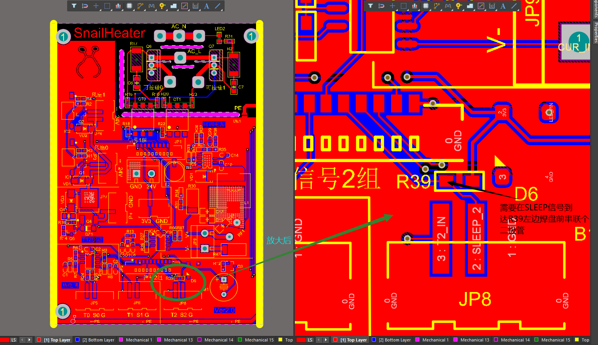
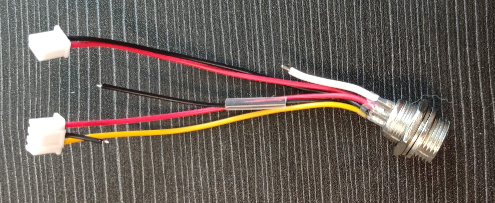
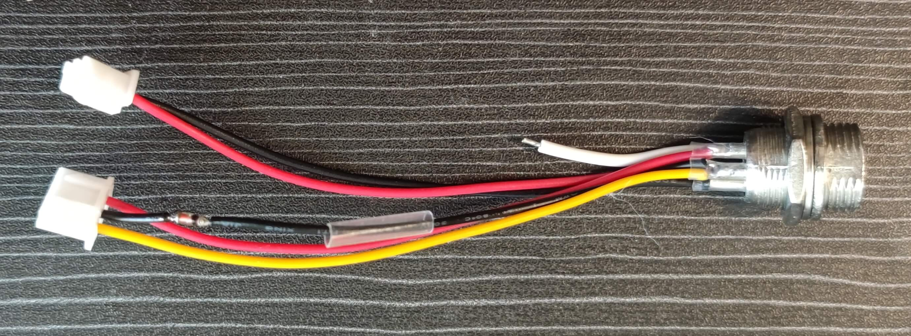
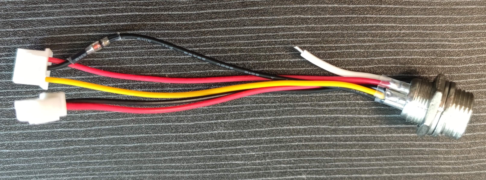
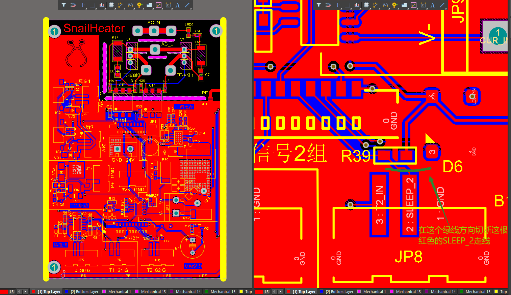
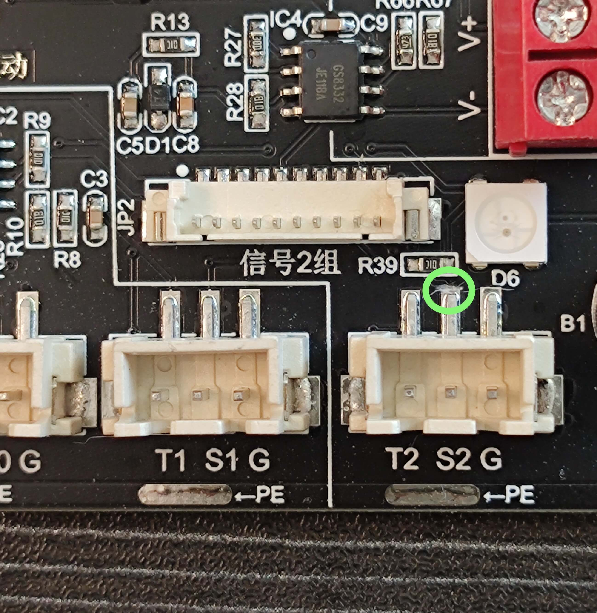
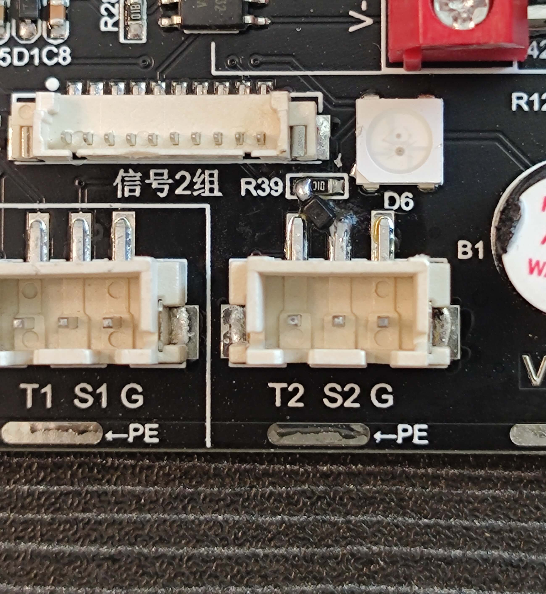
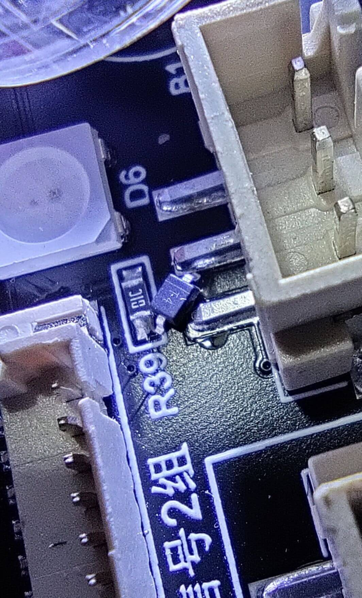

# 功率板V2.0硬件版本修改
本教程只针对于V2.0版本的功率板的修改，其他任何版本的PCB均不需要此操作！！！

由于功率板V2.0设计上的不完善，导致了容易因为烙铁烧主控引脚，故所有持有功率板V2.0的群友强制要修改。

# 目的
烙铁信号接口的S2处，在s2信号进入到R39电阻的左边焊盘前，需要串连一个二极管。

注：要求二极管的压降越小越好。建议`0.3v`压降的二极管。

为此提供两种修改方案，<a href="#方案一">方案一</a>焊接简单，<a href="#方案二">方案二</a>整体性合理。两种方案原理是一样的，选择合适自己的就可以，任何不懂的可以发群里问。

### <a id="方案一">方案一修改</a>
方案的思路：在连接线上处理。

优点：焊接难度低、风险低，不需要修改板子。

##### 1. 先在3pin的中间那根线头`0.5cm`或`1cm`处剪一刀。随后两端线头剥皮（一点点就够）、线头镀锡、套上`1.5cm`热缩管，待备。如下图所示：

##### 2. 二极管两端建议先上锡，将二极管焊在剪断的中间，注意二极管的负极朝着航空插的方向，焊接完需使用`万用表`测试二极管两端的压降，顺带确认方向。如下图所示：
二极管的购买连接（压降约0.25v） https://item.taobao.com/item.htm?spm=a1z0d.6639537/tb.1997196601.4.ea6d7484oXvrt2&id=528155505657

##### 3. 加热热缩管缩管

### <a id="方案二">方案二修改</a>
方案的思路：直接修改功率板。切断部分走线串联二极管。

优点：整体性更优，修改原则上更合理。

##### 1. 以下时要切断的走线示意图（原理图走线）。如下图所示：

##### 2. 实物板切断的走线示意图，切记割的是`S2`标识的引脚，别错了。如下图所示：

##### 3. 二极管的负极接在3pin座的中间一脚上，二极管的正极与R39电阻的左端连接，焊接完需使用`万用表`测试二极管两端的压降，顺带确认方向。如下图所示：
二极管的购买连接（压降约0.25v） https://item.taobao.com/item.htm?spm=a1z0d.6639537/tb.1997196601.4.ea6d7484oXvrt2&id=528155505657

方向参考

