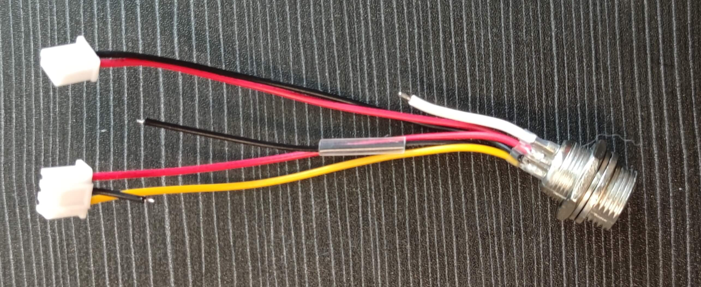
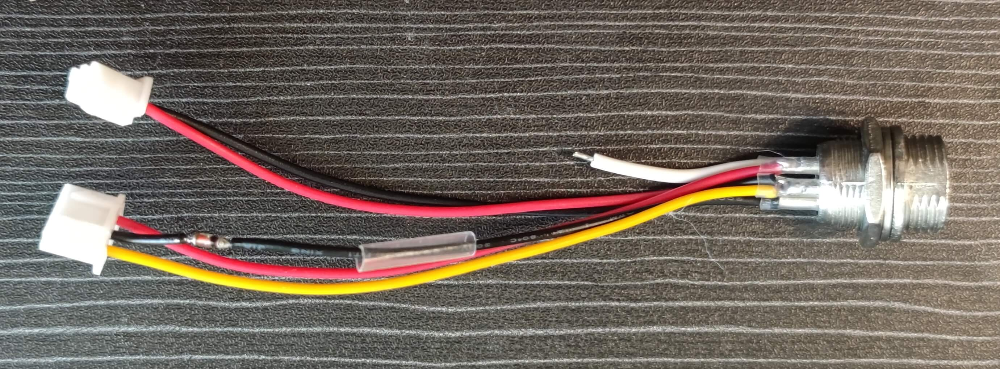
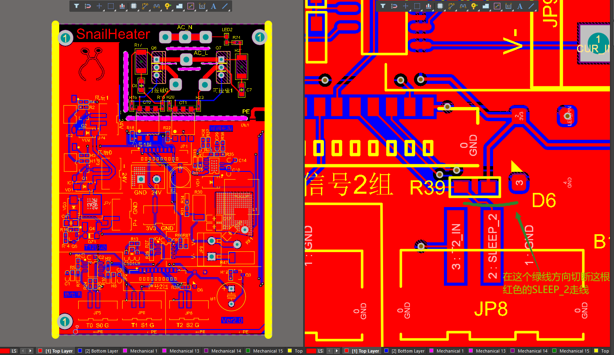
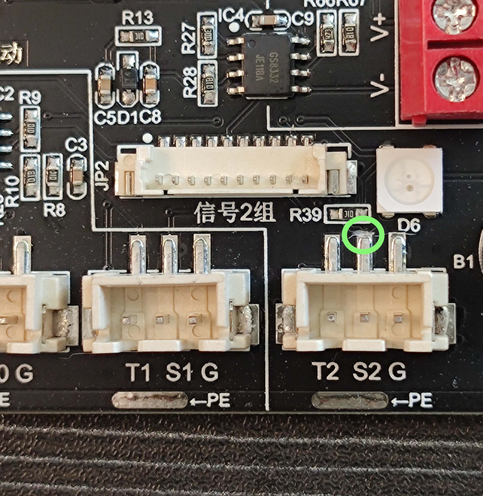
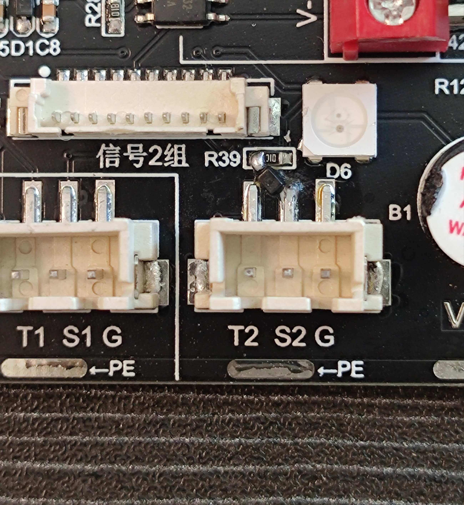
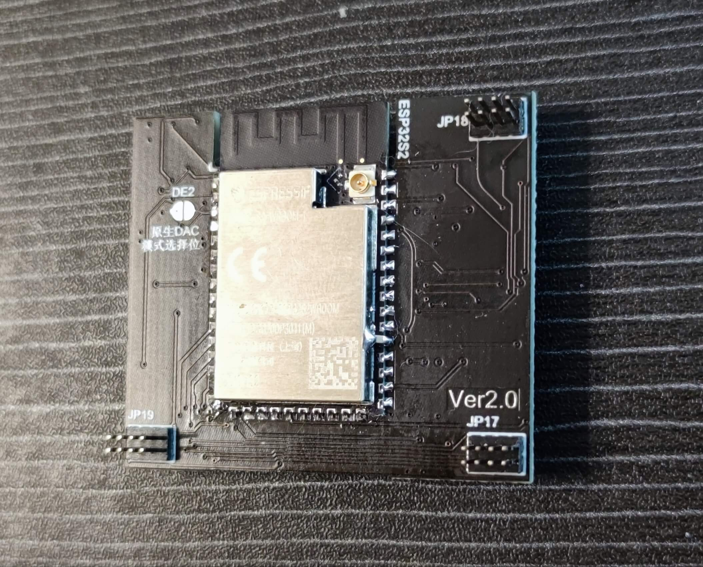

# 蜗牛台说明书

## 目录
<a href="#SnailHeater简介">SnailHeater简介</a>
<a href="#注意事项（非常重要）">注意事项（非常重要）</a>
<a href="#V2.0.X版本硬件（一车）">|---V2.0.X版本硬件（一车）</a>
<a href="#V2.5.X版本硬件（二车）">|---V2.5.X版本硬件（二车）</a>
<a href="#硬件配置与支持">硬件配置与支持</a>
<a href="#V2.0.X版本硬件配置与支持（一车）">|---V2.0.X版本硬件配置与支持（一车）</a>
<a href="#V2.5.X版本硬件配置与支持（二车）">|---V2.5.X版本硬件配置与支持（二车）</a>
<a href="#固件更新（刷机）">固件更新（刷机）</a>
<a href="#固件解释">|-----固件解释</a>
<a href="#固件支持与刷机工具">|-----固件支持与刷机工具</a>
<a href="#关于激活">|-----关于激活</a>
<a href="#焊台使用视频教程">焊台使用视频教程</a>
<a href="#使用指南">使用指南</a>
<a href="#烙铁">|---烙铁</a>
<a href="#热风枪">|---热风枪</a>
<a href="#加热台">|---加热台</a>
<a href="#可调电源">|---可调电源</a>
<a href="#其他附加功能">|---其他附加功能</a>
<a href="#关于保修（2023年6月22日起）">关于保修（2023年6月22日起）</a>
<a href="#硬件修改通知">硬件修改通知</a>
<a href="#V2.0.X版本硬件（一车）修改通知">|---V2.0.X版本硬件（一车）修改通知</a>
<a href="#一车 - 必须修改项">|------一车 - 必须修改项</a>
<a href="#一车 - 微小的优化">|------一车 - 微小的优化</a>
<a href="#V2.5.X版本硬件（二车）修改通知">|---V2.5.X版本硬件（二车）修改通知</a>
<a href="#二车 - 烙铁头对地（PE）电压比较高">|------二车 - 烙铁头对地（PE）电压比较高</a>
<a href="#二车 - 可调电源电压自动升压问题">|------二车 - 可调电源电压自动升压问题</a>
<a href="#二车 - 风枪和加热台误报链接错误（此问题影响较小）">|------二车 - 风枪和加热台误报链接错误（此问题影响较小）</a>
<a href="#二车 - 优化项">|------二车 - 优化项</a>

## SnailHeater简介 
 __`项目是适合创客的半开源焊台工具！`__ 

多功能焊台，简称 __"蜗牛台"__ 。平板加热台、风枪、烙铁、可调电源多控。本项目内有220V高压，务必小心，后果自负。

* 本项目的地址 https://github.com/ClimbSnail/SnailHeater （github为最新资料）
* 或者 https://gitee.com/ClimbSnailQ/SnailHeater （gitee非最新，仅为预览）
* 上一代旧版控制器项目 https://github.com/ClimbSnail/HeatPlatform_SMT （底成本方案）

本项目使用ESP32S2模组开发。同时控制加热板、风枪、烙铁、数字可调电源工作 。本项目将持续优化，不做半吊子。为防止后期咸鱼倒卖，只提供一个简单的demo，主线源码不开源，DIY玩家可免费领取2个序列号。

另外：为了充分利用硬件资源，将会附带双路示波器（采样2M）、函数发生器、高精度脉冲输出（可用于点焊机）。额外会有锁屏时钟等等超多功能。

## 注意事项（非常重要） 

### V2.0.X版本硬件（一车） 
1. 主机插接电源线情况下，__`禁止`__ 触摸 __`前置风枪的GX16航空头`__ 与 __`后置加热台GX16航空头`__ 內部的针脚。
2. 烙铁、风枪、加热台插接第三方的手柄，都需要对照`组装教程`中的`手柄接线规范`，否则 __`必损毁主机！`__
3. 在插接220V电源线情况下，风枪、加热台 __`不允许`__ 带电拔插，带电拔插有可能会烧毁主机，但凡发生一次意外，主机将产生不可逆的损坏。
4. 一车硬件不支持自动识别烙铁芯，硬件也不支持JBC210烙铁手柄。
5. 可调电源`支持短路保护`，但 __`不支持反接保护`__ 。在连接`电池`、`超级电容`等此类`自带能量`的供电设备时，不允许接错正负极，同时 __`禁止`__ 在可调电源关闭（不输出）的情况下接入外部电池。以上操作均会轻则烧毁可调电路，重则整机不亮，推荐最好的办法就是`不要给电池、超级电容供电`。
6. 默认`触摸开关`是关闭的，大部分机器打开触摸开关就会出现`菜单`反复显示隐藏的bug，故默认情况下关闭。只有部分机器可用触摸开关。如出现`菜单`反复显示隐藏的bug，请重新刷机。

### V2.5.X版本硬件（二车） 
1. 主机插接电源线情况下，__`禁止`__ 触摸 __`前置风枪的GX16航空头`__ 与 __`后置加热台GX16航空头`__ 內部的针脚。
2. 烙铁、风枪、加热台插接第三方的手柄，都需要对照`组装教程`中的`手柄接线规范`，否则 __`必损毁主机！`__
3. 在插接220V电源线情况下，风枪、加热台 __`不允许`__ 带电拔插，带电拔插有可能会烧毁主机，但凡发生一次意外，主机将产生不可逆的损坏。
4. v1.8.0固件起，全面支持烙铁芯自动识别（需手动打开 __`烙铁芯识别`__ 功能）。发货时的固件为旧版本固件，并未支持自动识别烙铁芯，请升级最新版本固件。若未手动开启 __`烙铁芯识别`__ 功能，在插接烙铁手柄 __`前`__ ，必须先选择好`烙铁芯类型`，否则轻则温度不对应 重则会导致烙铁头高温而损坏烙铁头。
5. 可调电源`支持短路保护`，但 __`不支持反接保护`__ 。在连接`电池`、`超级电容`等此类`自带能量`的供电设备时，不允许接错正负极，同时 __`禁止`__ 在可调电源关闭（不输出）的情况下接入外部电池。以上操作均会轻则烧毁可调电路，重则整机不亮，推荐最好的办法就是`不要给电池、超级电容供电`。
6. 默认`触摸开关`是关闭的，大部分机器打开触摸开关就会出现`菜单`反复显示隐藏的bug，故默认情况下关闭。只有部分机器可用触摸开关。如出现`菜单`反复显示隐藏的bug，请重新刷机。

## 硬件配置与支持 
### V2.0.X版本硬件配置与支持（一车） 
1. 烙铁支持T12、JBC245 _`（不支持JBC210）`_ ，内置电源达200W功率，与主控供电隔离。
2. 支持858D相关类型的风枪，同时接口也支持加热板（分体式），最大支持2000W。共两个GX16接口，支持风枪加热板盲插。
3. 可调电源：全数字可调，输出0.8V~22.8V之间的电压，电流可达5A _`（不支持恒流）`_ ，3A以上负载文波80mv内。内置软件过流保护（可自定义阈值），内置硬件短路保护。（硬件 _`纹波不稳定`_ ，待统一通知修复方案）
4. 内置NTC环境补偿。另外还设置全套温度自动校准方案，无需额外测温仪。（注：待固件更新支持）
5. 使用TFT 1.69寸240*280的tft彩屏，使用LVGL做界面，增强操作的动画效果。
6. 配套上位机软件，用于更新固件和绘制温控曲线等等。
7. 附带双路ADC采样电路（内置缓冲），用于开发双路示波器（最高采样2M）。
8. 预留DAC输出电路，用作单路函数发生器使用。
9. 预留高精度PWM输出接口，可外接点焊机作为可调脉冲信号。（后期提供电焊机配件）
10. 后期将会添加休眠功能，可用于显示天气、监控
11. 还会有更多的功能加入。。。。

注：一车版本通过更换`功率板`和`核心板`后等于二车版本。升级二车后的主机，在固件内部设置版本时完全按照二车`v2.5.x设置`。

### V2.5.X版本硬件配置与支持（二车） 
1. 烙铁支持T12、JBC245、JBC210等等，内置双电压电源24V/8A、12V6A，与主控供电隔离。
2. 支持858D相关类型的风枪，同时接口也支持加热板（分体式），最大支持2000W。共两个GX16接口，支持风枪加热板盲插。
3. 可调电源：全数字电压电流可调，输出0.8V~22.8V之间的电压，电流可达0~5A，1A以上负载文波25mv。内置软件过流保护（可自定义阈值），内置硬件短路保护。
4. 内置NTC环境补偿。另外还设置全套温度自动校准方案，无需额外测温仪。（注：待固件更新支持）
5. 使用TFT 1.69寸240*280的tft彩屏，使用LVGL做界面，增强操作的动画效果。
6. 配套上位机软件，用于更新固件和绘制温控曲线等等。
7. 附带双路ADC采样电路（内置缓冲），用于开发双路示波器（最高采样2M）。
8. 预留DAC输出电路，用作单路函数发生器使用。
9. 预留高精度PWM输出接口，可外接点焊机作为可调脉冲信号。（后期提供电焊机配件）
10. 后期将会添加休眠功能，可用于显示天气、监控
11. 还会有更多的功能加入。。。。

注：一车版本通过更换`功率板`和`核心板`后等于二车版本。升级二车后的主机，在固件内部设置版本时完全按照二车`v2.5.x设置`。

## 固件更新（刷机） 
### 固件解释 
焊台内部的控制程序（或者控制系统）称之为固件。

### 固件支持与刷机工具 
目前`v2.0.x`、`v2.1.x`、`v2.5.x`共使用同一个固件，下载群内提供的刷机工具进行刷机。刷机工具内部有 __`刷机教程链接`__ 。

刷机完毕后，必须在焊台的-> __`设置`__ -> __`系统`__ -> __`硬件版本`__ 中确定版本的正确设置。

__`注：`__ 每个成品焊台发出去前都刷好当时最新版本的固件，并激活过。到手正常情况下无需自己刷机和激活。

### 关于激活 
1. 名词解释: 
① __`机器码`__ 是指焊台的编号(有且只有一个，永久不变)。通过点击刷机工具的“查询”按钮获取
② __`激活码`__ 是用于指定机器码的焊台认证激活的密码(一个激活码仅解锁指定机器)。联系群主获取。
2. 每一台焊台的机器码是唯一的，并不会跟随固件变化。故每个焊台的激活码也是唯一的。v1.6.0及之后版本的固件，都需要激活码。未激活的焊台，界面是不可操作的（包括但不限于 设定了温度也无法生效），并且屏幕上会显示 _`未激活`_ 字样。
3. __`“首次”`__ 或 __`“清空方式”`__ 刷入v1.6.0及以后的版本，刷机完成后，需要将激活码填入刷机工具中激活焊台。激活成功后，刷机工具信息窗会显示激活成功。
4. __`查询激活码：`__ 如果是成品机或者已登记过激活码的机器，点击刷机工具中的 _`查询`_ 按钮，即可查询到激活码。

## 焊台使用视频教程 
待更新视频教程。。。。

## 使用指南（未完善） 
### 烙铁 
注：手柄接线必须参考__`组装教程.pdf文档`__接线。
1. v1.8.0固件起，全面支持烙铁芯自动识别（需手动打开 __`烙铁芯识别`__ 功能）。发货时的固件为旧版本固件，并未支持自动识别烙铁芯，请升级最新版本固件。若未手动开启 __`烙铁芯识别`__ 功能，在插接烙铁手柄 __`前`__ ，必须先选择好`烙铁芯类型`，否则轻则温度不对应 重则会导致烙铁头高温而损坏烙铁头。
2. 群主默认批量的手柄是 __`内置震动开关的`__ ，设置中关于烙铁 __`唤醒模式`__ 应当设置为 __`change模式`__ 。想要修改为休眠座的群友，请将震动开关 __`拆除`__ 或者 __`断开一脚`__ （目的让震动开关失效），将休眠座的休眠线接主机后面板的休眠孔上（2mm白色香蕉头），并设置 __`唤醒模式`__ 为 __`high`__ 。

注：JBC245、JBC210的手柄比较紧，需要插到底部，知道烙铁界面能够识别出温度为止。

### 热风枪 
注：使用第三方手柄必须参考__`组装教程.pdf文档`__接线。拔插必须 __`关闭电源开关`__ 操作。
1. 热风枪默认插接主机 __`前置航空头`__ 。
2. 固件内对于热风枪的温度校准为出风口`1cm`处。相对于市面上现成未特殊校准过的风枪，温度更高一些，故`300`度即可达到普通风枪`350~400`度的效果。温度与风速无关，校准在30%风速下进行即可。
3. （二车v2.5.x）不插接热风枪手柄时，可能出现固件显示的风枪温度不正常（仅显示，并没有安全问题）， <a href="#二车 - 风枪和加热台误报链接错误（此问题影响较小）">具体请看</a>

### 加热台 
注：必须参考__`组装教程.pdf文档`__接线。拔插必须 __`关闭电源开关`__ 操作。
1. 加热台默认插接主机 __`后置航空头`__ 。
2. 目前固件内部使用__`软开关`__启停加热台。需要在加热台界面点击电源开关方可工作。
3. 由于加热台热容比较大，使得关闭后降温很慢，属于正常现象。
4. （二车v2.5.x）不插接加热台时，可能出现固件显示的加热台温度不正常（仅显示，并没有安全问题），具体请看 <a href="#二车 - 风枪和加热台误报链接错误（此问题影响较小）">具体请看</a>

### 可调电源 
<a href="#二车 - 可调电源电压自动升压问题">目前存在的问题</a>

### 其他附加功能 
待固件支持

## 关于保修（2023年6月22日起）:  
1. 二车所有批量预定的机器都是群主亲测无误后发出，内部功能理应到手即用。为确保机器到大家手上时是正常的，收到货后如有外观损坏，两天内淘宝发消息报备问题。破损问题会第一时间处理。
2. 检查烙铁、风枪、加热台、可调电源四个主功能是否都正常，若有功能不正常，请在到货【7天】内在淘宝报备功能故障。
3. 到货7天后发生的问题将视为“正常使用故障”或“人为故障”，正常使用损坏 __`三个月内`__ 免费维修， __`人为损坏`__ 或 __`三个月后`__ 需付费维修。

__`注：`__ 因个人制作手柄时，接线错误导致机器部分电路损坏视为 __`人为损坏`__ 。有问题先及时报备，私自拆机不提供保修。

## 硬件修改通知 

### V2.0.X版本硬件（一车）修改通知 <a id="#V2.0.X版本硬件（一车）">
#### 一车 - 必须修改项 

 __`问题描述：`__ 由于功率板V2.0设计上的不完善，导致了容易因为烙铁烧主控引脚，故所有持有功率板V2.0的群友强制要修改。

 __`解决方案：`__ 烙铁信号接口的S2处，在s2信号进入到R39电阻的左边焊盘前，需要串连一个二极管。

 

为此提供两种修改方案，方案一焊接简单，方案二整体性合理。两种方案原理是一样的，选择合适自己的就可以，任何不懂的可以发群里问。

 __`方案一修改`__ 
方案的思路：在连接线上处理。

优点：焊接难度低、风险低，不需要修改板子。

1. 先在3pin的中间那根线头`0.5cm`或`1cm`处剪一刀。随后两端线头剥皮（一点点就够）、线头镀锡、套上`1.5cm`热缩管，待备。如下图所示：

2. 二极管两端建议先上锡，将二极管焊在剪断的中间，注意二极管的负极朝着航空插的方向，焊接完需使用`万用表`测试二极管两端的压降，顺带确认方向。如下图所示：
二极管的购买连接（压降约0.25v） https://item.taobao.com/item.htm?spm=a1z0d.6639537/tb.1997196601.4.ea6d7484oXvrt2&id=528155505657

3. 加热热缩管缩管

 __`方案二修改`__ 
方案的思路：直接修改功率板。切断部分走线串联二极管。

优点：整体性更优，修改原则上更合理。

1. 以下时要切断的走线示意图（原理图走线）。如下图所示：

2. 实物板切断的走线示意图，切记割的是`S2`标识的引脚，别错了。如下图所示：

3. 二极管的负极接在3pin座的中间一脚上，二极管的正极与R39电阻的左端连接，焊接完需使用`万用表`测试二极管两端的压降，顺带确认方向。如下图所示：
二极管的购买连接（压降约0.25v） https://item.taobao.com/item.htm?spm=a1z0d.6639537/tb.1997196601.4.ea6d7484oXvrt2&id=528155505657

方向参考

 __`补充说明：`__ 要求二极管的压降越小越好。建议`0.3v`压降的二极管。

#### 一车 - 微小的优化 

 __`问题描述：`__ 主要针对优化烙铁的休眠功能（软件上可以使用更好的休眠功能），可修改也可不修改。

 __`解决方案：`__ 在核心板模组从下往上数的第5个引脚串连一个`100nf(0.1uf/104)`电容，电容的另一端连接到模组最上边的GND脚上。如下图所示：

 __`补充说明：`__ 由于主控模组的屏蔽罩也是`GND`，故也可以如下焊接方案（更简洁）

### V2.5.X版本硬件（二车）修改通知 <a id="#V2.5.X版本硬件（二车）">
### 二车 - 烙铁头对地（PE）电压比较高 

 __`问题描述：`__ 若烙铁头对地（PE）的电压比较高（高到10V、20V），使用过程中可能烧毁器件。

 __`解决方案：`__ 由于目前蜗牛台配套使用的`AC-DC24V`电源接地的问题，与原先功率板的的接地方式不匹配，导致烙铁金属外壳对PE将有24V电压。故统一修改一处电阻，如下图是所示， _`R25`_ 原先使 _`1M`_ 的电阻，现需要并上一颗 _`1K`_ 左右的电阻。

注：实际上 _`1M`_ 替换成 _`1K`_ 也可行，为了后期可能使用 _`蜗牛台专用电源`_ ，推荐请保留改 _`1M`_ 电阻。

 __`补充说明：`__ 购买`二车`（v2.5.0）的成品`功率板`和DIY的群友自行修改。购买`主机`且 _`2023年5月31日`_ 之前发货的群友可自行修改，如果不方便，主机可寄回给群主处理。

### 二车 - 可调电源电压自动升压问题 

 __`问题描述：`__ 随着使用时间的拉长，可调电源输出的电压会逐渐增大，机壳内或者外围环境温度越高现象越明显，大电流输出情况下此现象也越明显。原因是可调电源使用的二极管极其容易受温度影响，使得器件的参数发生变化，控制的电压输出也随之变化。

 __`解决方案：`__ 修改下图中的黑色的二极管 _`D16`_ ，更改成 _`1N4148WS`_ （封装为SOD-323 丝印一般是T4），注意二极管的方向。推荐链接购买 https://item.taobao.com/item.htm?spm=a1z09.2.0.0.63882e8dFnpTDo&id=661687019354&_u=dmp44q8405c

 __`补充说明：`__ 购买`二车`（v2.5.0）的成品`功率板`和DIY的群友自行修改。购买`主机`且 _`2023年7月12日`_ 之后发货或者返修发货的机器都是修改完的（无需自己修改），之前发货的群友可自行修改，如果不方便，主机可寄回给群主处理。

### 二车 - 风枪和加热台误报链接错误（此问题影响较小） 

 __`问题描述：`__ 此现象仅在于 _`未连接`_ 风枪手柄或加热台时，焊台风枪或加热台的显示数值却不是NA，并且伴随着 _`断开/连接`_ 警报提示。环境温度较高时，此现象明显。

 __`解决方案：`__ 修改下图中的两个黑色的二极管 _`D7`_ 和 _`D14`_ ，都更改成 _`1N4148WS`_ （封装为SOD-323 丝印一般是T4），注意二极管的方向。推荐链接购买 https://item.taobao.com/item.htm?spm=a1z09.2.0.0.63882e8dFnpTDo&id=661687019354&_u=dmp44q8405c

 __`补充说明：`__ 购买`二车`（v2.5.0）的成品`功率板`和DIY的群友自行修改。购买`主机`且  __`2023年7月12日`__  之后发货或者返修发货的机器都是修改完的（无需自己修改），之前发货的可自行修改，如果不方便，主机可寄回给群主处理。

### 二车 - 优化项 
 __`问题描述：`__ 如下图所示，功率板与机壳之间使用一颗螺丝连接，该落实为了固定功率板的同时也为了让机壳接地。该螺丝如果强制拧紧板子，将会导致功率板变形，因此有概率在运输过程中导致螺丝松动，甚至点掉落在机壳内。

 
  __`解决方案：`__ 推荐所有已在拆机状态的群友，在螺丝四周打上热熔胶或者中稠的硅橡胶。

  __`补充说明：`__ 无