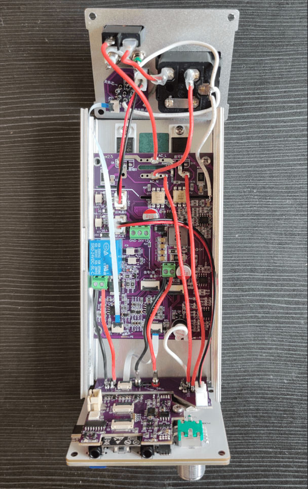
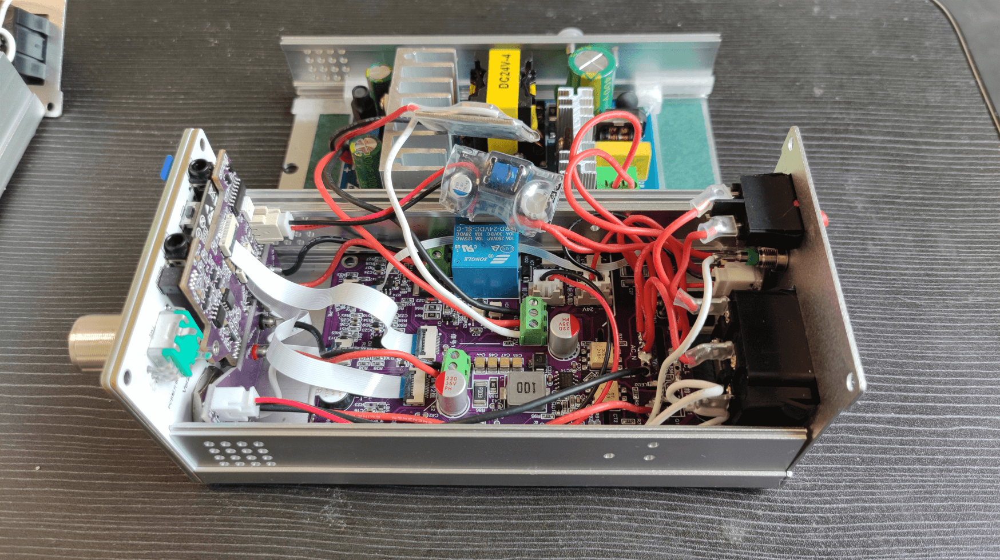

# SnailHeater接线教程
### 免责声明：
#### 由于本作品涉及到220V交流电，需有一点基础的人员才可操作。未能正确估量自己的能力，发生触电等有损人身安全的事故，均与本项目开发者无关。也提醒大家，接线过程中不要接220V，一定要断电操作！！！

本教程对SnailHeater主机接线提供一个统一的接线规范。关于手柄接线请参考 __`《蜗牛台全系接线引脚定义.pdf》`__。SnailHeater主机包含5款PCB板，分别为`内嵌板`、`屏幕板`、`核心板`、`接线拓展版`、`驱动板`。本教程涉及的非元器件外的配件在此在线文档中均有购买连接推荐或者相关描述：蜗牛台文档目录 https://docs.qq.com/doc/DQWd3cW5HYkxBWFBh 的`《物料清单》`中（请区分硬件版本）。

核心板的数据采集来源于驱动板，在未接驱动板的情况下，数值是无参考意义的。而驱动板是的逻辑是由核心板控制的，所以在未接线或核心板不可用的情况下请勿使用AC220供电。

在阅读接下来的文档前，希望大家观看视频教程，以至于对SnailHeater整体有个清晰的认识。请观看 蜗牛台文档目录 https://docs.qq.com/doc/DQWd3cW5HYkxBWFBh 的`《蜗牛台整体介绍》`视频。

涉及的接口有：
* 烙铁口GX12-5 （T12/JBC245通用）
* 可调电源输出`2mm香蕉头`或`GX12-4航空头`
* 前置风枪/加热台`GX16-8`
* 后置风枪/加热台`GX16-8`
* 品字电源座、船型开关
* 额外接地口、与JBC休眠口 `2mm香蕉头`

补充知识：
1. 带针的航空头成为公头，不带针的称之为母头。
2. 主机上安装的都是公头。所有的航空头都有一个防呆缺口（防止插错），防呆缺口的左右两边对应的是`1脚`和`n脚`，整体编号是按顺序编号的（顺逆不定）。
3. 航空母头的外壳为金属，注意内部弹片的焊线高度不要顶到外壳上，以免造成短路。
4. 焊接前，为了更好的焊接，建议所有的多股线头缠绕后镀锡，航空头的每个针都要线镀锡。
5. 为了更安全的防止短路，航空头与线头的连接处使用2mm直径的热缩管防护，故焊接前先在每根线上套好热缩管。
6. 一般新的风枪加热后会有`白烟`，属于正常现象。因为内部云母纸的特性，初始受热会产生烟雾，然后云母纸变脆，使用一段时间后就正常了。

## 快捷导航
<a href="#各个板子介绍">各个板子介绍</a>
<a href="#配件准备工作">配件准备工作</a>
<a href="#AC-DC 5V电源">|-----AC-DC 5V电源</a>
<a href="#DC-DC 12V电源">|-----DC-DC 12V电源</a>
<a href="#安装">安装</a>
<a href="#1. 屏幕板安装">|-----1. 屏幕板安装</a>
<a href="#2. 安装核心板">|-----2. 安装核心板</a>
<a href="#3. 安装前置接口">|-----3. 安装前置接口</a>
<a href="#4. 安装后置面板">|-----4. 安装后置面板</a>
<a href="#5. 机壳准备">|-----5. 机壳准备</a>
<a href="#6. 安装固定驱动板">|-----6. 安装固定驱动板</a>
<a href="#7. 内部主要接线视图">|-----7. 内部主要接线视图</a>
<a href="#8. 组装后整体效果">|-----8. 组装后整体效果</a>

***

## <a id="各个板子介绍">各个板子介绍</a>
###### 屏幕板 ⬇
本图实际上是包含了`内嵌板`拍的

###### 内嵌板（为屏幕的保护框） ⬇

###### 接线拓展板 ⬇
.jpg)
注：左边一小部分是后置面板用的接线板，右边长条是前置前置面板的接线板。使用的时候，需要用钳子剪一下再掰，以免掰断铜层。

###### 核心板 ⬇

###### 驱动板 ⬇

***
## <a id="配件准备工作">配件准备工作</a>

#### <a id="AC-DC 5V电源">AC-DC 5V电源</a>
此5V电源给系统供电，要求低纹波，纹波越小系统越稳定。蜗牛台内含可调电源，因此对系统供电纹波有一定要求。

蜗牛台统一推荐一款纹波较好的电源（自带双电压输出5V + 3V3），如下图。
注：V2.0版本硬件（一车版本）使用的是`3.3V`，从一车升级到V2.5版本的需要将原本`3v3`接线改为`5V`口输出。

###### 准备材料：
1. 一段3.5cm直径20mm的热缩管
2. 80mm单头XH2.54线材一段
3. 2根80cm 22AWG规格的线材一段（尽量比24AWG粗就行）

此电源的直流低压输出端分别是：3V3 GND 5V（从左到右）

#### <a id="DC-DC 12V电源">DC-DC 12V电源</a>
此电源是用于`JBC210`这样需要12V电源的烙铁芯供电，从24V大电源取电。（如果不需要`JBC210`，可省略此电源）
注：虽然通过pwm限制24V电源输出的能量，理论上也可以控制jbc210，但实际调试的过程中很容易烧毁国产的烙铁芯。倘若将频率调高，整个mos管的通断效率也会降低，故直接加入`12V dc-dc电路`供给JBC210。

以下推荐使用`SY8205模块`（峰值6A），淘宝5元随意买。但默认此模组出厂为5V，需要自行调整模块上的`R1`和`R2`，将`R1`调整至220k `R2`调整为12K，改完之后理论值为`11.6V`（从群主那购买的12V电源模块均已改好）。如下图所示：

###### 准备材料：
1. 一段3cm直径16mm的热缩管
2. 80mm 20AGWG硅胶线 黑红各一根
3. 130mm 20AWG硅胶线 白色一根

红线接24V大电源正极、黑线接24V大电源负极、白线接驱动板12V标识的接线端子。

***

## <a id="安装">安装</a>

### <a id="1. 屏幕板安装">1. 屏幕板安装</a>
屏幕板有上个开孔，从左到右依次是：GX12-5航空头（烙铁接口）、GX12-4航空头/2MM香蕉头的通用接口（可调电源输出使用）、GX16-8航空头（风枪接口）。

屏幕板的可调电源口物理上支持两种接口（GX12-4或者2mm香蕉头）。
###### 接口优缺点：
GX12-4优点是可以将内部24V原电压也一块引出。
2mm香蕉头优点是接线电阻更低一些也更符合市面上的可调电源的接口形式。

##### 实物图片

屏幕为中景园的1.69寸280*240，驱动为ST7789V。旋钮为普通的EC11编码器。

`R106`、`R107`为预留的调试电阻，不需要焊

为尽可能美观，故`EC11编码器`（即旋钮）使用倒装的方式安装（将5个引脚用钳子掰180度，一定要轻）
屏幕板PCB铜柱的连接上`硬件清单中`，规格是`M3*6+1`（1为底部固定引脚的直径）

屏幕板EC11旋钮下方的裸漏镀锡层（开窗）为触摸开关的按键，需要加一层薄薄的锡，盖上内嵌板后方可导电到上层的内嵌板，实现触摸按键的功能。

***

### <a id="2. 安装核心板">2. 安装核心板</a>

此结构也是刷够刷固件的最少硬件要求。

注：核心板上`R3`圆形封装的电阻是需要焊接热敏电阻，具体型号为`M52-10K-B3950 1%`(本图拍摄时忘记焊上了)

***

### <a id="3. 安装前置接口">3. 安装前置接口</a>

注：如上图所示，航空头缺口要朝上（不过有另类的航空头比较特殊）

插入接线板，让航空头的角度刚刚好。确保接口方向都正常后，将航空头焊到接线板上。

接线材料（从左到右）：
1. GX16-8风枪接口 丝印所指示的两个`发热芯`引脚各使用13cm 20AWG硅胶线接出。丝印指示的`地线`使用7cm左右的20AWG硅胶线引出。（由于风枪是220V交流电供电，故不分正负）
2. 中间两个2mm香蕉头使用两个7cm 20AWG硅胶线引出，红为正极、黑为负。
3. GX12-5烙铁接口的`发热芯正极`和`发热芯负极`分别使用7cm 20AWG的硅胶线引出。

***

### <a id="4. 安装后置面板">4. 安装后置面板</a>

1. GX16-8接口为安全起见，一定要先套上GX16专用的`防尘塞`，不然焊接线板后就不好套上了。
2. 绿色和白色的香蕉头都为2mm香蕉头。绿色香蕉口为额外地线引脚，可接防静电手环（让手环也能接地）。白色为烙铁外置休眠口，主要为了支持JBC默认的休眠座。
3. 品字电源座部分是不带保险管的，需要自行查看是否需要购置保险管（2*50mm 250V/10A）。另外，保险管一侧尽可能朝内，这样插拔线的时候周围空间不至于紧。

1. 后置接线板的丝印指示点`外置休眠`需要接一根线连接`白色的2mm香蕉头`（推荐从接线板底下绕线）
2. 接线板丝印指示`地线`与绿色香蕉头都使用一根线连接到品字电源座的地线引脚，如上图
3. 接线小板上指示的两个`发热芯`引脚（7、8脚）需要使用7cm 20AWG硅胶线引出，这两根线之后会接220V，所以不分正负。
4. 品字电源座的`N`线引脚接一根7cm 20AWG的硅胶线并套好热缩管（后续连接驱动板需要）。
5. 品字电源座的`L`端接一根短线到`窗船型开关`（注意：事先套好热缩管）
6. `船型开关`的另一端接一根7cm 20AWG的硅胶线并套好热缩管（后续连接驱动板需要）。

***

### <a id="5. 机壳准备">5. 机壳准备</a>

推荐购买群内批量的机壳。自行加工一套200，很贵！！！

底部最好贴上硅胶垫，焊台使用的时候能够防滑。

两面都加装青稞纸

***

### <a id="6. 安装固定驱动板">6. 安装固定驱动板</a>

1. 先将可控硅的引脚插在驱动板上弯折（弯折程度请参考下图）。为了更安全，驱动板上的可控硅安装脚距比较大，实际买到的可控硅间距比较小，需要自行拉开一点才可以插进去。
2. 驱动板左下角的孔通过一颗`M3*8mm`的螺丝固定到机壳地板，此步骤既是固定驱动板，同时也是让机壳连接驱动板的地线。

一共两组可控硅，推荐型号`BTA08-600`或者`BTA12-600`（尽可能买正品，寿命长），可控硅是带220V市电的，故需要安全可靠的结构。（以下是二车之后的外壳，一车外壳是装侧面导热）
1. 可控硅金属散热盘与机壳之间使用`氧化铝导热片`（规格12*18*0.6）绝缘。
2. 可控硅上面需要使用耐高温的`TO-220 绝缘胶粒`才可拧螺丝固定，很重要！！！

***

### <a id="7. 内部主要接线视图">7. 内部主要接线视图</a>

1. 机壳后面板的`接线小板`与`驱动板`的fpc规格为`fpc 4pin 15cm同向`，风扇供电使用`XH2.54 双头80mm 同向线`连接。
2. 屏幕板的`接线拓展板`与`驱动板`的fpc规格为`fpc 6pin 6cm同向`，风扇供电使用`XH2.54 双头80mm 同向线`连接。
3. 前置`接线拓展板`的白色地线焊接到`驱动板`的小长条的`PE焊点`上

1. 连接上`AC-DC 24V`大电源，24V电源为淘宝`24V4A`的廉价电源，峰值8A左右。AC端接驱动板的AC端。DC24V输出端接驱动板的24V接线座上。
2. 此前准备的`DC-DC 12V`电源模块的红黑线输入端接24V大电源的输出接线座，白线12V接驱动板的`12V接线端`（GND旁边的12V标识）。
3. `AC-DC 5V`小电源的5V输出接核心板的`XH2.54 接线座`上。

***

### <a id="8. 组装后整体效果">8. 组装后整体效果</a>

`上主机`是`可调电源输出接口`为`GX12-4`的主机样品，`下主机`是`可调电源输出接口`为`2mm香蕉头`的主机样品。
1. 屏幕板使用`大平头倒边螺丝 十字 8mm`与机壳固定。
2. 后面板使用机壳自带的小型内嵌螺丝。

***

### 关于手柄接线
请参考 __`《蜗牛台全系接线引脚定义.pdf》`__