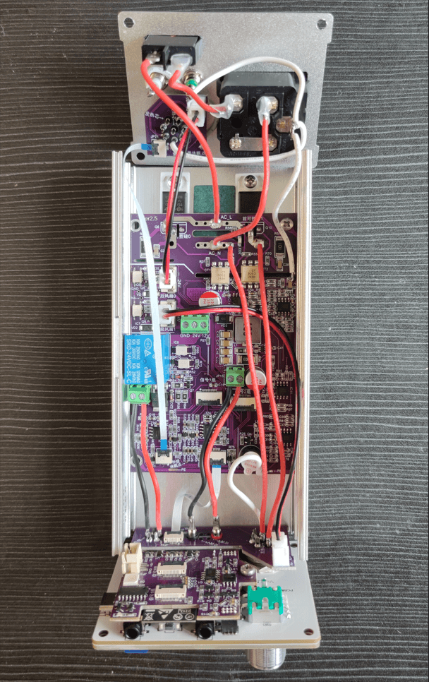
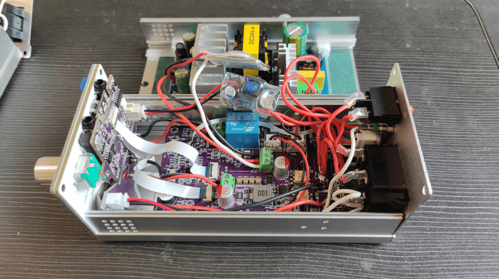
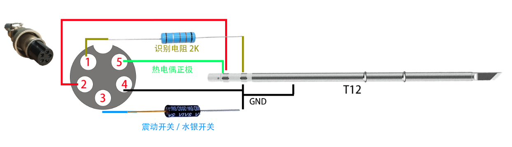
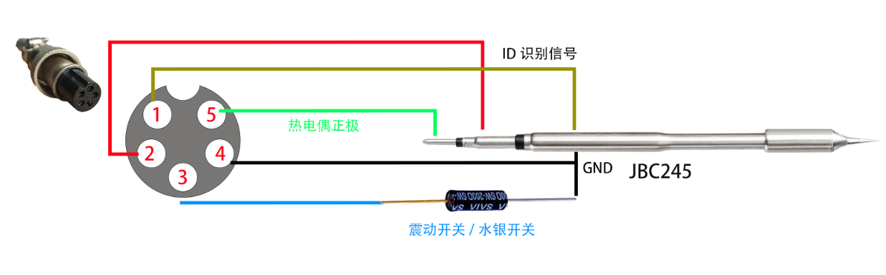
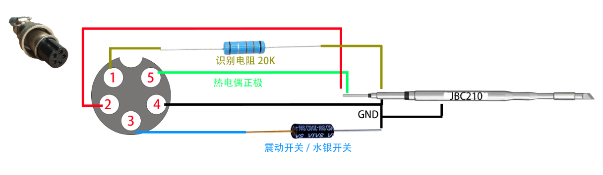
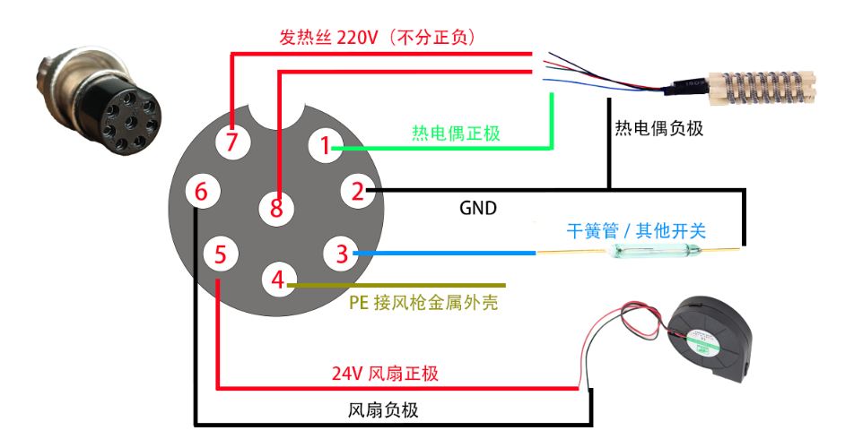

# SnailHeater接线教程
### 免责声明：
#### 由于本作品涉及到220V交流电，需有一点基础的人员才可操作。未能正确估量自己的能力，发生触电等有损人身安全的事故，均与本项目开发者无关。也提醒大家，接线过程中不要接220V，一定要断电操作！！！

本教程对SnailHeater主机接线提供一个统一的接线规范。SnailHeater主机包含5款PCB板，分别为`内嵌板`、`屏幕板`、`核心板`、`接线拓展版`、`驱动板`。本教程涉及的配件在此在线文档中均有购买连接推荐或者相关描述： https://docs.qq.com/sheet/DQUlDclNBWXhFbUdW

核心板的数据采集来源于驱动板，在未接驱动板的情况下，数值是无参考意义的。而驱动板是的逻辑是由核心板控制的，所以在未接线或核心板不可用的情况下请勿使用AC220供电。

在阅读接下来的文档前，希望大家观看视频教程，以至于对SnailHeater整体有个清晰的认识。https://www.bilibili.com/video/BV1oG4y1h7A8

涉及的接口有：
* 烙铁口GX12-5 （T12/JBC245通用）
* 可调电源输出`2mm香蕉头`或`GX12-4航空头`
* 前置风枪/加热台`GX16-8`
* 后置风枪/加热台`GX16-8`
* 品字电源座、船型开关
* 额外接地口、与JBC休眠口 `2mm香蕉头`

补充知识：
1. 带针的航空头成为公头，不带针的称之为母头。
2. 主机上安装的都是公头。所有的航空头都有一个防呆缺口（防止插错），防呆缺口的左右两边对应的是`1脚`和`n脚`，整体编号是按顺序编号的（顺逆不定）。
3. 航空母头的外壳为金属，注意内部弹片的焊线高度不要顶到外壳上，以免造成短路。
4. 焊接前，为了更好的焊接，建议所有的多股线头缠绕后镀锡，航空头的每个针都要线镀锡。
5. 为了更安全的防止短路，航空头与线头的连接处使用2mm直径的热缩管防护，故焊接前先在每根线上套好热缩管。
6. 一般新的风枪加热后会有`白烟`，属于正常现象。因为内部云母纸的特性，初始受热会产生烟雾，然后云母纸变脆，使用一段时间后就正常了。

***

## <a id="各个板子介绍">各个板子介绍</a>
###### 屏幕板 ⬇
本图实际上是包含了`内嵌板`拍的

###### 内嵌板（为屏幕的保护框） ⬇

###### 接线拓展板 ⬇
.jpg)
注：左边一小部分是后置面板用的接线板，右边长条是前置前置面板的接线板。使用的时候，需要用钳子剪一下再掰，以免掰断铜层。

###### 核心板 ⬇

###### 驱动板 ⬇

***
## <a id="配件准备工作">配件准备工作</a>

#### <a id="AC-DC 5V电源">AC-DC 5V电源</a>
此5V电源给系统供电，要求低纹波，纹波越小系统越稳定。蜗牛台内含可调电源，因此对系统供电纹波有一定要求。

蜗牛台统一推荐一款纹波较好的电源（自带双电压输出5V + 3V3），如下图。
由于V2.0版本硬件（一车版本）使用的是`3.3V`，从一车升级到V2.5版本的需要将原本`3v3`接线改为`5V`口输出。并套上附送的大号热缩管。

###### 准备材料：
1. 一段3.5cm直径20mm的热缩管
2. 80mm单头XH2.54线材一段
3. 2根80cm 22AWG规格的线材一段（尽量比24AWG粗就行）

此电源的直流低压输出端分别是：3V3 GND 5V（从左到右）

#### <a id="DC-DC 12V电源">DC-DC 12V电源</a>
此电源是用于`JBC210`这样需要12V电源的烙铁芯供电，从24V大电源取电。（如果不需要`JBC210`，可省略此电源）
注：虽然通过pwm限制24V电源输出的能量，理论上也可以控制jbc210，但实际调试的过程中很容易烧毁国产的烙铁芯。倘若将频率调高，整个mos管的通断效率也会降低，故直接加入`12V dc-dc电路`供给JBC210。

以下推荐使用`SY8205模块`（峰值6A），淘宝5元随意买。默认此模组出厂为5V，大家到手的模组已是改好12V电压的了。如下图所示：

###### 准备材料：
1. 一段3cm直径16mm的热缩管
2. 80mm 20AGWG硅胶线 黑红各一根
3. 130mm 20AWG硅胶线 白色一根

红线接24V大电源正极、黑线接24V大电源负极、白线接驱动板12V标识的接线端子。

***

## <a id="安装">安装</a>

### <a id="1. 屏幕板安装">1. 屏幕板安装</a>
屏幕板有上个开孔，从左到右依次是：GX12-5航空头（烙铁接口）、GX12-4航空头/2MM香蕉头的通用接口（可调电源输出使用）、GX16-8航空头（风枪接口）。

屏幕板的可调电源口物理上支持两种接口（GX12-4或者2mm香蕉头）。
###### 接口优缺点：
GX12-4优点是可以将内部24V原电压也一块引出。
2mm香蕉头优点是接线电阻更低一些也更符合市面上的可调电源的接口形式。

##### 实物图片

屏幕为中景园的1.69寸280*240，驱动为ST7789V。旋钮为普通的EC11编码器。

`R106`、`R107`为预留的调试电阻，不需要焊

为尽可能美观，故`EC11编码器`（即旋钮）使用倒装的方式安装（将5个引脚用钳子掰180度，一定要轻）
屏幕板PCB铜柱的连接上`硬件清单中`，规格是`M3*6+1`（1为底部固定引脚的直径）

屏幕板EC11旋钮下方的裸漏镀锡层（开窗）为触摸开关的按键，需要加一层薄薄的锡，盖上内嵌板后方可导电到上层的内嵌板，实现触摸按键的功能。

***

### <a id="2. 安装核心板">2. 安装核心板</a>

此结构也是刷够刷固件的最少硬件要求。

注：核心板上`R3`圆形封装的电阻是需要焊接热敏电阻，具体型号为`M52-10K-B3950 1%`(本图拍摄时忘记焊上了)

***

### <a id="3. 安装前置接口">3. 安装前置接口</a>

注：如上图所示，航空头缺口要朝上（不过有另类的航空头比较特殊）

插入接线板，让航空头的角度刚刚好。确保接口方向都正常后，将航空头焊到接线板上。

接线材料（从左到右）：
1. GX16-8风枪接口 丝印所指示的两个`发热芯`引脚各使用13cm 20AWG硅胶线接出。丝印指示的`地线`使用7cm左右的20AWG硅胶线引出。（由于风枪是220V交流电供电，故不分正负）
2. 中间两个2mm香蕉头使用两个7cm 20AWG硅胶线引出，红为正极、黑为负。
3. GX12-5烙铁接口的`发热芯正极`和`发热芯负极`分别使用7cm 20AWG的硅胶线引出。

***

### <a id="4. 安装后置面板">4. 安装后置面板</a>

由于一车外壳不同，上图仅作参考。

1. 一车无白色香蕉头
2. 一车无绿色香蕉头
3. 接线小板上指示的两个`发热芯`引脚（7、8脚）需要使用7cm 20AWG硅胶线引出，这两根线之后会接220V，所以不分正负。
4. 品字电源座的`N`线引脚接一根7cm 20AWG的硅胶线并套好热缩管（后续连接驱动板需要）。
5. 品字电源座的`L`端接一根短线到`窗船型开关`（注意：事先套好热缩管）
6. `船型开关`的另一端接一根7cm 20AWG的硅胶线并套好热缩管（后续连接驱动板需要）。

***

### <a id="5. 机壳准备">5. 机壳准备</a>

推荐购买群内批量的机壳。自行加工一套200，很贵！！！

底部最好贴上硅胶垫，焊台使用的时候能够防滑。

两面都加装青稞纸

***

### <a id="6. 安装固定驱动板">6. 安装固定驱动板</a>

一车结构不同，上图仅参考。

一共两组可控硅，推荐型号`BTA08-600`或者`BTA12-600`（尽可能买正品，寿命长），可控硅是带220V市电的，故需要安全可靠的结构。（以下是二车之后的外壳，一车外壳是装侧面导热）
1. 可控硅金属散热盘与机壳之间使用`氧化铝导热片`（规格12*18*0.6）绝缘。
2. 可控硅上面需要使用耐高温的`TO-220 绝缘胶粒`才可拧螺丝固定，很重要！！！

***

### <a id="7. 内部主要接线视图">7. 内部主要接线视图</a>

1. 机壳后面板的`接线小板`与`驱动板`的fpc规格为`fpc 4pin 15cm同向`，风扇供电使用`XH2.54 双头80mm 同向线`连接。
2. 屏幕板的`接线拓展板`与`驱动板`的fpc规格为`fpc 6pin 6cm同向`，风扇供电使用`XH2.54 双头80mm 同向线`连接。
3. 前置`接线拓展板`的白色地线焊接到`驱动板`的小长条的`PE焊点`上

1. 连接上`AC-DC 24V`大电源，24V电源为淘宝`24V4A`的廉价电源，峰值8A左右。AC端接驱动板的AC端。DC24V输出端接驱动板的24V接线座上。
2. 此前准备的`DC-DC 12V`电源模块的红黑线输入端接24V大电源的输出接线座，白线12V接驱动板的`12V接线端`（GND旁边的12V标识）。
3. `AC-DC 5V`小电源的5V输出接核心板的`XH2.54 接线座`上。

***

### <a id="8. 组装后整体效果">8. 组装后整体效果</a>

`上主机`是`可调电源输出接口`为`GX12-4`的主机样品，`下主机`是`可调电源输出接口`为`2mm香蕉头`的主机样品。
1. 屏幕板使用`大平头倒边螺丝 十字 8mm`与机壳固定。
2. 后面板使用机壳自带的小型内嵌螺丝。

***

### <a id="关于蜗牛台航空头引脚定义">关于蜗牛台航空头引脚定义</a>
补充知识点：手柄的接口没有标准的线序，市面上的手柄或者主机线序都是不统一的，所以各家品牌的手柄只支持接自家的主机。不能直接使用其他家的手柄插接SnailHeater主机上，需要改好接头的线序才行。

##### GX12-5航空头（烙铁）
航空头 GX12-5 | 1 | 2 | 3 | 4 | 5
:-: | :-: | :-: | :-: | :-: | :-:
含义 | 发热芯ID识别引脚 | 发热芯正极 | 振动开关正极 | 振动开关/发热芯/热电偶 负极 | 热电偶正极

##### 前后两个GX16-8航空头（风枪、加热台、烤箱）
航空头 GX16-8 | 1 | 2 | 3 | 4 | 5 | 6 | 7 | 8
:-: | :-: | :-: | :-: | :-: | :-: | :-: | :-: | :-:
功能说明 | 电偶正 | 电偶负、磁控 | 磁控 | 风枪金属外壳 | 风扇正 | 风扇负 | 发热丝 | 发热丝

***

### <a id="手柄接线规范">手柄接线规范</a>

补充知识点：烙铁手柄的接口没有标准的线序，市面上的手柄或者主机线序都是不统一的，所以各家品牌的手柄只支持接自家的主机。不能直接使用其他家的手柄插接SnailHeater主机上，需要改好接头的线序才行。

### T12手柄

航空头 GX12-5 | 1 | 2 | 3 | 4 | 5
:-: | :-: | :-: | :-: | :-: | :-:
含义 | 识别引脚 | 发热芯正极 | 振动开关正极 | 振动开关/发热芯/热电偶 负极 | 热电偶正极

注：
* 振动开关的金色脚靠近硅胶线方向。航空头的2号和5号引脚是短接的，图片中热缩管那部分。

***

### JBC245手柄

航空头 GX12-5 | 1 | 2 | 3 | 4 | 5
:-: | :-: | :-: | :-: | :-: | :-:
含义 | 识别引脚 | 发热芯正极 | 振动开关正极 | 振动开关/发热芯/热电偶 负极 | 热电偶正极

注：
* 振动开关的金色脚靠近硅胶线方向。
* 如果使用休眠座，就不需要焊接 __`震动开关/水银开关`__ ，3脚休眠信号悬空即可。

##### 注：以下JBC245手柄的`ID识别信号`在手柄的航空头内部实现了跳线

1. 由于手柄空间问题，本手柄使用的为4.2mm外径的4芯线，且振动开关需要把外皮剥掉。

依旧由于空间的问题，塞入振动开关时容易卡住，手柄塞入需要推PCB的同时拉尾部的硅胶线，具体操作自行摸索。最终完成的状态如下。

***

### JBC210手柄

航空头 GX12-5 | 1 | 2 | 3 | 4 | 5
:-: | :-: | :-: | :-: | :-: | :-:
含义 | 识别引脚 | 发热芯正极 | 振动开关正极 | 振动开关/发热芯/热电偶 负极 | 热电偶正极

注：
* 振动开关的金色脚靠近硅胶线方向。航空头的2号和5号引脚是短接的，图片中热缩管那部分。
* 如果使用休眠座，就不需要焊接 __`震动开关/水银开关`__ ，3脚休眠信号悬空即可。

***

### 热风枪手柄
以下线序和SnailHeater主机的接口对应

航空头 GX16-8 | 1 | 2 | 3 | 4 | 5 | 6 | 7 | 8
:-: | :-: | :-: | :-: | :-: | :-: | :-: | :-: | :-:
功能说明 | 电偶正 | 电偶负、开关（磁控或其他开关） | 开关另一端（磁控或其他开关） | 风枪金属外壳 | 风扇正 | 风扇负 | 发热丝 | 发热丝

##### 接完线后，必须单独测量手柄航空头！！！
> 由于航空头外壳是金属的，故推荐接好线后，给7、8引脚套上热缩管，避免短路导电。
> 7、8引脚为220V发热芯供电引脚。7、8引脚与其他任何引脚之间均不相连且电阻无穷大（使用电阻档测量），此两脚必须严格检查并测试。
> 5、6引脚为24V风扇电机供电引脚，与其他任何引脚之间均不相连且电阻无穷大（使用电阻档测量）

***

### 加热台本体（可参考风枪手柄接线图）
注：SnailHeater加热台与热风枪的物理接口一致，只是少了风扇和开关信号，但整体和热风枪的线序是一致的。热风枪\加热台为AC220供电，故接口将会有高压输出，请勿在通电状态下触摸航空头的`内针`。

SnailHeater的加热台可以使用群内定制的发热板，也可以使用淘宝现成的铸铝发热板，甚至可以使用廉价的PTC发热板。前提是都需要有热电偶测温。

##### 以下是定制加热板的图：

##### 以下为发热芯内部拆解图，银白色的导线为电热丝（220V），故打孔的时候需要注意别穿到导线（中间有一长条没有空闲区可打孔）。供电线不分正负极。

通常来说，热电偶的蓝线为负极，红线则为正极。发热芯的供电线为纯红色两根，不分正负极。

航空头 GX16-8 | 1 | 2 | 3 | 4 | 5 | 6 | 7 | 8
:-: | :-: | :-: | :-: | :-: | :-: | :-: | :-: | :-:
功能说明 | 电偶正（红线） | 电偶负（蓝线） | 空 | 接地线（连接加热板金属部分） | 空 | 空 | 发热丝（红线） | 发热丝（红线）

##### 接完线后，必须单独测量手柄航空头！！！
> 由于航空头外壳是金属的，故推荐接好线后，给7、8引脚套上热缩管，避免短路导电。
> 7、8引脚为220V发热芯供电引脚。7、8引脚与其他任何引脚之间均不相连且电阻无穷大（使用电阻档测量），此两脚必须严格检查并测试。
> 5、6引脚为24V风扇电机供电引脚（也可没有风扇），与其他任何引脚之间均不相连且电阻无穷大（使用电阻档测量）

附送的氧化铝保温棉内部有金属物质，尽量避免保温棉进入发热芯引发导电。另外群内定制的加热板是可以通过螺丝来引出地线的。具体请参考`加热板安装`的视频教程！！！
