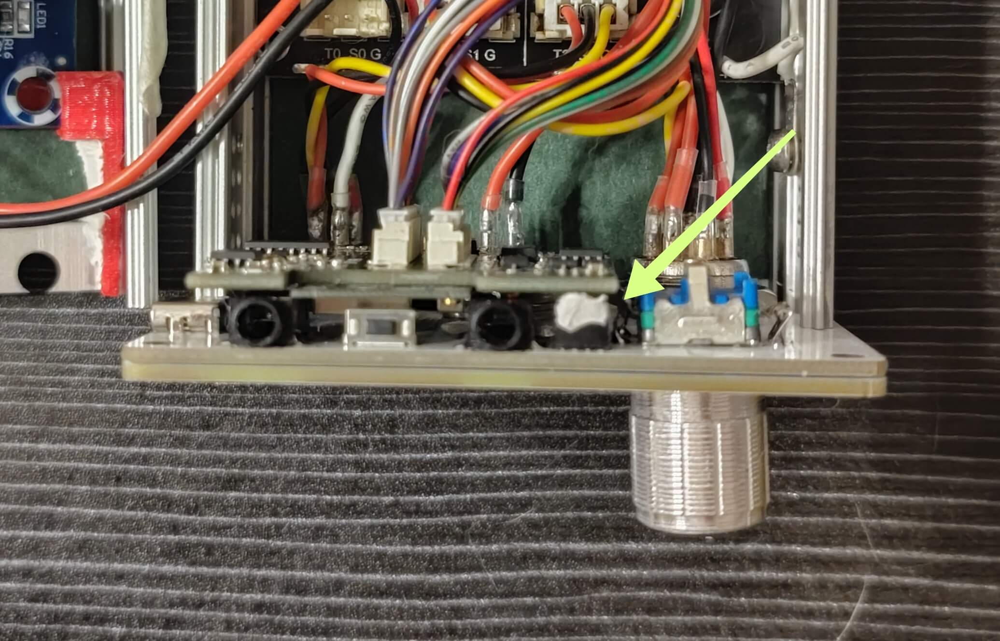
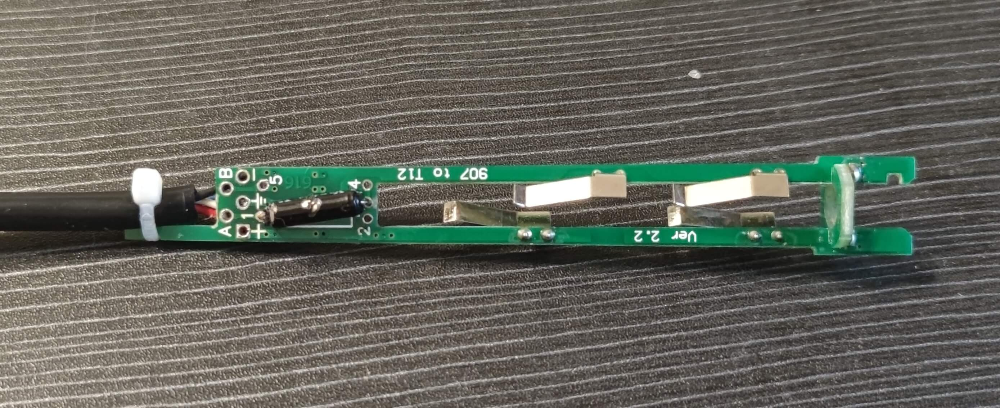

# SnailHeater接线教程
本教程对SnailHeater主机接线提供一个统一的接线规范。SnailHeater主机包含三块PCB板，分别为`屏幕前面板`、`核心板`、`功率板`。接线主要针对于`功率板`上的接口。功率板是的逻辑是由核心板控制的，所以在未接线或核心板不可用的情况下请勿使用AC220供电。

在阅读接下来的文档前，希望大家观看视频教程，以至于对SnailHeater整体有个清晰的认识。https://www.bilibili.com/video/BV1oG4y1h7A8?spm_id_from=333.337.search-card.all.click

涉及的接口有：
* 烙铁口GX12-5 （T12/JBC245通用）
* 可调电源输出GX12-4 
* 前置风枪/加热台GX16-8
* 后置风枪/加热台GX16-8
* 品字电源座、船型开关。

补充知识：
1. 带针的航空头成为公头，不带针的称之为母头。
2. 主机上安装的都是公头。所有的航空头都有一个防呆缺口（防止插错），防呆缺口的左右两边对应的是`1脚`和`n脚`，整体编号是按顺序编号的（顺逆不定）。
3. 航空母头的外壳为金属，注意焊线高度不要顶到外壳上，以免造成短路。
4. 焊接前，为了更好的焊接，建议所有的多股线头缠绕后镀锡，航空头的每个针都要线镀锡。
5. 为了更安全的防止短路，航空头与线头的连接处使用2mm直径的热缩管防护，故焊接前先在每根线上套好热缩管。
6. 一般新的风枪加热后会有`白烟`，属于正常现象。因为内部云母纸的特性，初始受热会产生烟雾，然后云母纸变脆，使用一段时间后就正常了。

以下为`功率板`上的逻辑接口功能：

***

### 1. 核心板与功率板的逻辑连接

* `功率板`的`信号1组`接口通过`10cm双头同向1.25mm的10排线`连接`核心板`上的`信号1组`接口。
* `功率板`的`信号2组`接口（另一个10p座）通过`8cm双头同向1.25mm的10排线`连接`核心板`上的`信号2组`接口。

***

### 2. 烙铁口接线

##### 注：非常重要！！！由于设计上的疏漏，所有持有V2.0版本功率板的群友，都必须修改烙铁部分电路，修改方法参考群文件中的`功率板V2.0硬件版本修改方法.pdf`，不修改的话，插上烙铁容易直接损坏主控芯片，造成不可逆的后果。

##### 准备线材（使用推荐的线长）
* GX12-5航空头
* 黑红双色的2pin_10cm单头XH2.54排线
* 3pin_8cm单头XH2.54排线
* 22AWG软硅胶线 3cm白线
* 5个0.5cm长直径2mm的透明热缩管

注：焊接线前先将航空头拧在前面板固定。

航空头 GX12-5 | 1 | 2 | 3 | 4 | 5
:-: | :-: | :-: | :-: | :-: | :-:
线色 | 3cm软白线 | 2pin红线 | 3pin黑线 | 同时接2pin黑与3pin黄线 | 3pin红线
功能说明 | 可接PE | P+ | 振动开关正极 | 振动开关/发热芯/热电偶 负极 | 热电偶正极

***

### 3. 可调电源接线

##### 准备线材（使用推荐的线长）
* GX12-4航空头
* 22AWG软硅胶线 6.5cm红色
* 22AWG软硅胶线 6.5cm黑色
* 4个0.5cm长直径2mm的透明热缩管

航空头 GX12-4 | 1 | 2 | 3 | 4
:-: | :-: | :-: | :-: | :-:
线色 | 黑线 | 待升级 | 待升级 | 红线
功能说明 | V-(电源GND) | 3.3V | 24V | V+(可调电源正极)

注：`待升级`为本图中未做示范的引脚，可自行引出24V与3.3V电平。焊接线前先将航空头拧在前面板固定。

***

### 4. 前置风枪/加热台接线
补充知识点：风枪的接口没有标准的线序，市面上的风枪手柄或者主机线序都是不统一的，所以各家品牌的风枪手柄只支持接自家的主机。不能直接使用其他家的风枪手柄插接SnailHeater主机上，需要需改好接头的线序才行。热风枪\加热台为AC220供电，故接口将会有高压输出，请勿在通电状态下触摸航空头的`内针`。

##### 准备线材（使用推荐的线长）
* GX16-8航空头
* 22AWG软硅胶线 16cm红色
* 22AWG软硅胶线 16cm黑色
* 22AWG软硅胶线 4cm白线
* 黑红双色的2pin_12cm单头XH2.54排线
* 3pin_9cm单头XH2.54排线
* 8个0.5cm长直径2mm的透明热缩管

使用`前置风枪/加热台`，请接上`可控硅1`。焊接线前先将航空头拧在前面板固定。

##### 以下是主机的航空
航空头 GX16-8 | 1 | 2 | 3 | 4 | 5 | 6 | 7 | 8
:-: | :-: | :-: | :-: | :-: | :-: | :-: | :-: | :-:
功能说明 | 电偶正 | 电偶负、磁控 | 磁控 | 风枪金属外壳 | 风扇正 | 风扇负 | 发热丝 | 发热丝
线序 | 3pin红 | 3pin黄 | 3pin黑 | 软白线 | 2pin红 | 2pin黑 | 红硅胶线 | 黑硅胶线

***

### 5. 后置风枪/加热台接线
补充知识点：风枪的接口没有标准的线序，市面上的风枪手柄或者主机线序都是不统一的，所以各家品牌的风枪手柄只支持接自家的主机。不能直接使用其他家的风枪手柄插接SnailHeater主机上，需要需改好接头的线序才行。热风枪\加热台为AC220供电，故接口将会有高压输出，请勿在通电状态下触摸航空头的`内针`。

##### 准备线材（使用推荐的线长）
* GX16-8航空头
* 22AWG软硅胶线 9cm红色（可不参考示图中的长度）
* 22AWG软硅胶线 9cm黑色（可不参考示图中的长度）
* 22AWG软硅胶线 8/15cm白线（示图中未接，请自行连接到就近带有PE标识的焊盘上）
* 黑红双色的2pin_10cm单头XH2.54排线
* 3pin_14cm单头XH2.54排线
* 8个0.5cm长直径2mm的透明热缩管

使用`后置风枪/加热台`接口，请接上`可控硅0`。焊接线前先将航空头拧在前面板固定。

航空头 GX16-8 | 1 | 2 | 3 | 4 | 5 | 6 | 7 | 8
:-: | :-: | :-: | :-: | :-: | :-: | :-: | :-: | :-:
功能说明 | 电偶正 | 电偶负、磁控 | 磁控 | 风枪金属外壳 | 风扇正 | 风扇负 | 发热丝 | 发热丝
线序 | 3pin红 | 3pin黄 | 3pin黑 | 软白线 | 2pin红 | 2pin黑 | 红硅胶线 | 黑硅胶线

***

### 6. 整体供电接线

##### AD220-DC24V电源线材
* 22AWG软硅胶线 13cm红色，共3根
* 22AWG软硅胶线 13cm黑色
__注：__
__1. 上示图中的电源本人为了测试拆掉了散热片，大家制作的过程中不要理会，记得别去拆！！！__
__2. 此24V电源的AC接线座比较深，容易开关通电后电源仍未接上电（指示灯不亮）。AC接线座两根红线一定要剥皮长大于5mm(记得上锡)不容易虚接。__

##### AD220-DC3.3V电源线材
* 22AWG软硅胶线 10cm红色，共2根
* 黑红双色的2pin_9cm单头XH2.54排线

##### 品字座与开关
* 22AWG软硅胶线 8白线
* 其他线长自行估摸
* 一定要准备若干热缩管

***

### 7. 外壳接地

外壳通过`接线弹片`连接到功率板的PE（地）。

***

### 8. 组装完成后的图

电源支架：为了方便使用，两个支架是同一个模型，先确保靠近前面板部分的支架（图片中红色支架）正常安装，最后安装靠尾部一头的支架会发现支架长于机壳，需要把靠后的这个支架（图片中白色支架）多出来的部分剪短（两个支架 只有一个需要剪），具体也可参考视频部分的讲解。

***

### 合盖提示
由于核心板和前面板使用排针连接，很容易由于电源挤压到线材，间接将`核心板`从`前面板`上扯下，导致连接`异常`或`不稳定`，故推荐将上部分排针连接处打胶处理，等胶干透后合盖。如下图：

注：这白色的是STARS-922胶

***

### 9. T12手柄
补充知识点：烙铁手柄的接口没有标准的线序，市面上的手柄或者主机线序都是不统一的，所以各家品牌的手柄只支持接自家的主机。不能直接使用其他家的手柄插接SnailHeater主机上，需要改好接头的线序才行。

航空头 GX12-5 | 1 | 2 | 3 | 4 | 5（与2号脚短接）
:-: | :-: | :-: | :-: | :-: | :-:
含义 | 地 | P+ | 振动开关正极 | 振动开关/发热芯/热电偶 负极 | 热电偶正极
T12手柄架 | 地标识位 | + | A | -黑、B蓝 | 无独立物理孔
线序 | 绿 | 红 | 白 | 黑、蓝 | 无

注：振动开关的金色脚靠近硅胶线方向。航空头的2号和5号引脚是短接的，图片中热缩管那部分。

***

### 10. JBC245手柄
补充知识点：烙铁手柄的接口没有标准的线序，市面上的手柄或者主机线序都是不统一的，所以各家品牌的手柄只支持接自家的主机。不能直接使用其他家的手柄插接SnailHeater主机上，需要改好接头的线序才行。

航空头 GX12-5 | 1 | 2 | 3 | 4（可与1号引脚短接） | 5
:-: | :-: | :-: | :-: | :-: | :-:
含义 | 地 | P+ | 振动开关正极 | 振动开关/发热芯/热电偶 负极 | 热电偶正极
JBC245手柄架 | 无 | 中间段焊点 | 外接热电偶 | 最前端焊点 | 最后端焊点
线序 | 黑 | 红 | 白 | 黑 | 绿

1. 由于手柄空间问题，本手柄使用的为4.2mm外径的4芯线，且振动开关需要把外皮剥掉。振动开关的金色脚靠近硅胶线方向。注意观察每个状态！！！
2. JBC245烙铁芯本身没有独立的地线，需要航空头的4号和1号引脚可以选择短接，即可使手柄接地。

依旧由于空间的问题，塞入振动开关时容易卡住，手柄塞入需要推PCB的同时拉尾部的硅胶线，具体操作自行摸索。最终完成的状态如下。

***

### 11. 热风枪手柄
以下线序和SnailHeater主机的接口对应

航空头 GX16-8 | 1 | 2 | 3 | 4 | 5 | 6 | 7 | 8
:-: | :-: | :-: | :-: | :-: | :-: | :-: | :-: | :-:
功能说明 | 电偶正 | 电偶负、开关（磁控或其他开关） | 开关另一端（磁控或其他开关） | 风枪金属外壳 | 风扇正 | 风扇负 | 发热丝 | 发热丝

***

### 12. 加热台本体
注：SnailHeater加热台与热风枪的物理接口一致，只是少了风扇和开关信号，但整体和热风枪的线序是一致的。热风枪\加热台为AC220供电，故接口将会有高压输出，请勿在通电状态下触摸航空头的`内针`。

SnailHeater的加热台可以使用群内定制的发热板，也可以使用淘宝现成的铸铝发热板，甚至可以使用廉价的PTC发热板。前提是都需要有热电偶测温。

##### 以下是定制加热板的图：

##### 以下为发热芯内部拆解图，银白色的导线为电热丝（220V），故打孔的时候需要注意别穿到导线（中间有一长条没有空闲区可打孔）。供电线不分正负极。

通常来说，热电偶的蓝线为负极，红线则为正极。发热芯的供电线为纯红色两根，不分正负极。

航空头 GX16-8 | 1 | 2 | 3 | 4 | 5 | 6 | 7 | 8
:-: | :-: | :-: | :-: | :-: | :-: | :-: | :-: | :-:
功能说明 | 电偶正（红线） | 电偶负（蓝线） | 空 | 接地线（连接加热板金属部分） | 空 | 空 | 发热丝（红线） | 发热丝（红线）

附送的氧化铝保温棉内部有金属物质，尽量避免保温棉进入发热芯引发导电。另外群内定制的加热板是可以通过螺丝来引出地线的。具体请参考`加热板安装`的视频教程！！！
