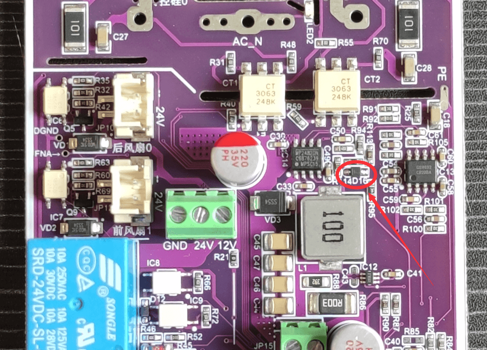

# 蜗牛台说明书

## 目录
<a href="#SnailHeater简介">SnailHeater简介</a>
<a href="#注意事项（非常重要）">注意事项（非常重要）</a>
<a href="#V2.0.X版本补充说明（一车）">|---V2.0.X版本补充说明（一车）</a>
<a href="#V2.5.X版本补充说明（二车）">|---V2.5.X版本补充说明（二车）</a>
<a href="#V2.6.X版本补充说明（三车）">|---V2.6.X版本补充说明（三车）</a>
<a href="#各版本功能对比">各版本功能对比</a>
<a href="#固件更新（刷机）">固件更新（刷机）</a>
<a href="#固件解释">|-----固件解释</a>
<a href="#固件支持与管理工具">|-----固件支持与管理工具</a>
<a href="#关于激活">|-----关于激活</a>
<a href="#焊台使用视频教程">焊台使用视频教程</a>
<a href="#使用指南">使用指南</a>
<a href="#烙铁">|---烙铁</a>
<a href="#热风枪">|---热风枪</a>
<a href="#加热台">|---加热台</a>
<a href="#可调电源">|---可调电源</a>
<a href="#信号发生器">|---信号发生器</a>
<a href="#点焊机">|---点焊机</a>
<a href="#其他附加功能">|---其他附加功能</a>
<a href="#关于保修（2023年6月22日起）">关于保修（2023年6月22日起）</a>
<a href="#硬件修改通知">硬件修改通知</a>
<a href="#V2.0.X版本硬件（一车）修改通知">|---V2.0.X版本硬件（一车）修改通知</a>
<a href="#一车 - 必须修改项">|------一车 - 必须修改项</a>
<a href="#一车 - 微小的优化">|------一车 - 微小的优化</a>
<a href="#V2.5.X版本硬件（二车）修改通知">|---V2.5.X版本硬件（二车）修改通知</a>
<a href="#二车 - 烙铁头对地（PE）电压比较高">|------二车 - 烙铁头对地（PE）电压比较高</a>
<a href="#二车 - 可调电源电压自动升压问题">|------二车 - 可调电源电压自动升压问题</a>
<a href="#二车 - 风枪和加热台误报链接错误（此问题影响较小）">|------二车 - 风枪和加热台误报链接错误（此问题影响较小）</a>
<a href="#二车 - 优化项">|------二车 - 优化项</a>
<a href="#V2.6.X版本硬件（三车）检查通知">|---V2.6.X版本硬件（三车）检查通知</a>
<a href="#三车 - 旋钮问题">|------三车 - 旋钮问题</a>
<a href="#三车 - 风枪航空头带电">|------三车 - 风枪航空头带电</a>
<a href="#三车 - 烙铁短路保护优化">|------三车 - 烙铁短路保护优化</a>

## SnailHeater简介 
 __`项目是适合创客的半开源焊台工具！`__ 

多功能焊台，简称 __"蜗牛台"__ 。平板加热台、风枪、烙铁、可调电源多控。本项目内有220V高压，务必小心，后果自负。

* 本项目的地址 https://github.com/ClimbSnail/SnailHeater （github为最新资料）
* 或者 https://gitee.com/ClimbSnailQ/SnailHeater （gitee非最新，仅为预览）
* 上一代旧版控制器项目 https://github.com/ClimbSnail/HeatPlatform_SMT （底成本方案）

本项目使用ESP32S2模组开发。同时控制加热板、风枪、烙铁、数字可调电源工作 。本项目将持续优化，不做半吊子。为防止后期咸鱼倒卖，只提供一个简单的demo，主线源码不开源。提供复刻所需要的所有资料（Gerber、BOM、组装教程等等）。目前机器刷机后需要激活码，激活码的获取规则参考交流群内最新动态。另外，本人也会不定期生产整机成品出售给有需要的群友。

另外：为了充分利用硬件资源，将会附带双路示波器（采样2M）、函数发生器、高精度脉冲输出（可用于点焊机）。额外会有锁屏时钟等等超多功能。

## 注意事项（非常重要） 

#### 致用户
购买了成品主机或复刻了主机的用户，需深刻明白 __`蜗牛台`__ 是专业电子工具，使用者应掌握相关安全知识、具备相关安全意识。使用者在接通本设备电源的那一刻起，已表示确认自己阅读本文并了解本设备所使用的220V交流电及本设备可能造成的危害！包括但不限于对于自身的烫伤、电击伤害及可能因高温引发其它问题。离开设备请及时关断电源，以免意外造成火灾。

#### 使用者对设备使用本身负有全部责任，使用本设备前务必知晓以下事项：
1. 烙铁、风枪、加热台插接第三方的手柄，都需要对照`《蜗牛台全系接线引脚定义.pdf》`，否则 __`必损毁主机！`__
2. __`前置风枪的GX16航空头`__ 与 __`后置加热台GX16航空头`__ 內部的针脚有220V高压，主机插接电源线情况下，__`禁止`__ 触摸 __內部的针脚。
3. 在插接220V电源线情况下，风枪、加热台 __`不允许`__ 带电拔插，带电拔插有可能会烧毁主机，但凡发生一次意外，主机将产生不可逆的损坏。注：烙铁手柄支持带电拔插。
4. 蜗牛台将会在合理的情况下，记录用户的`若干操作历史`，便于售后的原因分析，或辅助构建更稳定的固件系统。望理解！

#### V2.0.X版本补充说明（一车） 
1. 一车硬件不支持自动识别烙铁芯，硬件也不支持JBC210烙铁手柄。
2. 可调电源`支持短路保护`，但 __`不支持反接保护`__ 。在连接`电池`、`超级电容`等此类`自带能量`的供电设备时，不允许接错正负极，同时 __`禁止`__ 在可调电源关闭（不输出）的情况下接入外部电池。以上操作均会轻则烧毁可调电路，重则整机不亮，推荐最好的办法就是`不要给电池、超级电容供电`。
3. 默认`触摸开关`是关闭的，大部分机器打开触摸开关就会出现`菜单`反复显示隐藏的bug，故默认情况下关闭。只有部分机器可用触摸开关。如出现`菜单`反复显示隐藏的bug，请重新刷机。

#### V2.5.X版本补充说明（二车） 
1. v1.8.0固件起，全面支持烙铁芯自动识别（默认已开启 __`烙铁芯识别`__ 功能）。发货时的固件为旧版本固件，并未支持自动识别烙铁芯，请升级最新版本固件。若未手动开启 __`烙铁芯识别`__ 功能，在插接烙铁手柄 __`前`__ ，必须先选择好`烙铁芯类型`，否则轻则温度不对应 重则会导致烙铁头高温而损坏烙铁头。
2. 可调电源`支持短路保护`，但 __`不支持反接保护`__ 。在连接`电池`、`超级电容`等此类`自带能量`的供电设备时，不允许接错正负极，同时 __`禁止`__ 在可调电源关闭（不输出）的情况下接入外部电池。以上操作均会轻则烧毁可调电路，重则整机不亮，推荐最好的办法就是`不要给电池、超级电容供电`。
3. 默认`触摸开关`是关闭的，大部分机器打开触摸开关就会出现`菜单`反复显示隐藏的bug，故默认情况下关闭。只有部分机器可用触摸开关。如出现`菜单`反复显示隐藏的bug，请重新刷机。

#### V2.6.X版本补充说明（三车） 
1. 若未手动开启 __`烙铁芯识别`__ 功能，在插接烙铁手柄 __`前`__ ，必须先选择好`烙铁芯类型`，否则轻则温度不对应 重则会导致烙铁头高温而损坏烙铁头。
2. 可调电源`支持短路保护`，但 __`不支持反接保护`__ 。在连接`电池`、`超级电容`等此类`自带能量`的供电设备时，不允许接错正负极，同时 __`禁止`__ 在可调电源关闭（不输出）的情况下接入外部电池。以上操作均会内部保险丝，推荐最好的办法就是`不要给电池、超级电容供电`。

## 各版本功能对比 
注：一车版本通过更换`驱动板`和`核心板`后等于二车版本。升级二车后的主机使用固件注意事项与二车一模一样。

注：二车与三车外观尺寸和硬件都存在巨大的差异，故二车无法升级成三车。
#### 系统参数
| 版本 |  v2.0.x(一车) |  v2.5.x(二车) | v2.6.x(三车) |
| :--: | :-: | :-: | :-: |
|  外观尺寸  |  76x57x145mm 裸机537.3g |  76x57x150mm 裸机555g  |  97x60x150mm 裸机686.7g  |
|  控制核心性能  |  240M主频、320K RAM、4M Flash |  240M主频、320K RAM、4M Flash  |  240M主频、320K RAM、4M Flash  |
|  供电方式  |  AC110~240V 最大功率2000W |  AC110~240V 最大功率2000W  |  AC110~240V 最大功率2000W  |
|  屏幕大小  |  1.69寸240*280彩屏 |  1.69寸240*280彩屏  |  2.4寸240*320彩屏  |
|  Type-C固件升级  |  支持 |  支持  |  支持  |
|  触摸按键  |  无 |  无  |  一个  |
|  RGB效果灯  |  无 |  2颗 内置在机器内部  |  8颗集成在前面板  |
|  自定义锁屏动态壁纸  |  支持 |  支持  |  支持  |
|  配套电脑软件  |  支持 |  支持  |  支持  |
|  内置供电系统  |  双电源 |  三电源  |  三电源  |
|  固件支持  |  长期更新 |  长期更新  |  长期更新  |

#### 烙铁参数
| 版本 |  v2.0.x(一车) |  v2.5.x(二车) | v2.6.x(三车) |
| :--: | :-: | :-: | :-: |
|  最大功率支持  |  24V200W |  24V200W + 12V60W |  25.2V230W + 12V60W  |
|  发热芯支持  |  T12、C245 |  T12、C245、C210、C115、C470  |  T12、C245、C210、C115、C470  |
|  自动识别型号  |  不支持 |  支持 |  支持 |
|  热拔插  |  支持 |  支持 |  支持 |
|  短路保护  |  不支持 |  不支持 |  请查看文末三车相关"烙铁短路保护优化" |
|  自定义PID参数调整  |  支持 |  支持  |  支持  |
|  温度校准  |  支持 |  支持  |  支持  |
|  自定义温度快速设定  |  支持 |  支持  |  支持  |
|  唤醒模式  |  None手动、high休眠座、low水银开关、change震动开关 |  None手动、high休眠座、low水银开关、change震动开关  |  None手动、high休眠座、low水银开关、change震动开关  |
|  发热频率调整  |  支持 |  支持  |  支持  |

#### 风枪参数
| 版本 |  v2.0.x(一车) |  v2.5.x(二车) | v2.6.x(三车) |
| :--: | :-: | :-: | :-: |
|  发热芯最大功率支持  |  220V2000W |  220V2000W  |  220V2000W  |
|  风扇最大功率支持  |  24V2A |  24V2A  |  24V2A  |
|  热拔插  |  不支持 |  不支持 |  不支持 |
|  自定义PID参数调整  |  支持 |  支持  |  支持  |
|  温度校准  |  支持 |  支持  |  支持  |
|  自定义温度快速设定  |  支持 |  支持  |  支持  |
|  温控曲线设置  |  待固件支持 |  待固件支持  |  待固件支持  |

#### 加热台参数
| 版本 |  v2.0.x(一车) |  v2.5.x(二车) | v2.6.x(三车) |
| :--: | :-: | :-: | :-: |
|  发热芯最大功率支持  |  220V2000W |  220V2000W  |  220V2000W  |
|  风扇最大功率支持  |  24V2A |  24V2A  |  24V2A  |
|  热拔插  |  不支持 |  不支持 |  不支持 |
|  自定义PID参数调整  |  支持 |  支持  |  支持  |
|  温度校准  |  支持 |  支持  |  支持  |
|  自定义温度快速设定  |  支持 |  支持  |  支持  |
|  温控曲线设置  |  待固件支持 |  待固件支持  |  待固件支持  |

#### 可调电源参数
| 版本 |  v2.0.x(一车) |  v2.5.x(二车) | v2.6.x(三车) |
| :--: | :-: | :-: | :-: |
|  电压范围  |  0.8V~22.5V |  0.8V~22.5V  |  0.8V~24V  |
|  电流范围（由于散热问题固件限制3.5A）  |  0~5A |  0~5A  |  0~5A  |
|  支持模式  |  恒压 |  恒压、恒流  |  恒压、恒流  |
|  短路保护  |  支持 |  支持  |  支持  |
|  电流倒灌  |  支持 |  支持  |  支持  |
|  电池反接保护  |  不支持(会烧主机) |  不支持(会烧主机)  |  不支持(会内部保险管)  |
|  Vpp  |  过大已忽略 |  30mv  |  25mv  |
|  自定义调压快速通道  |  支持 |  支持  |  支持  |

#### 信号发生器参数
| 版本 |  v2.0.x(一车) |  v2.5.x(二车) | v2.6.x(三车) |
| :--: | :-: | :-: | :-: |
|  支持波形  |  方波/正弦波 |  方波/正弦波  |  方波/正弦波  |
|  方波频率  |  3Hz~2.5MHz |  3Hz~2.5MHz  |  3Hz~2.5MHz  |
|  正弦波频率  |  130Hz~55000Hz |  130Hz~55000Hz  |  130Hz~55000Hz  |
|  精度  |  \ |  \  |  \ |

#### 点焊机参数
| 版本 |  v2.0.x(一车) |  v2.5.x(二车) | v2.6.x(三车) |
| :--: | :-: | :-: | :-: |
|  单脉冲  |  支持 |  支持  |  支持  |
|  单向双脉冲  |  支持 |  支持  |  支持  |
|  脉冲调节范围  |  0.1ms~100ms |  0.1ms~100ms  |  0.1ms~100ms  |
|  可调脉冲步进  |  0.1ms |  0.1ms  |  0.1ms  |
|  脉冲精度  |  0.01ms |  0.01ms  |  0.01ms  |
|  精度  |  \ |  \  |  \ |

## 固件更新（刷机） 
#### 固件解释 
焊台内部的控制程序（或者控制系统）称之为固件。

#### 固件支持与管理工具 
下载群内提供的管理工具进行刷机。管理工具内部有 __`刷机教程链接`__ 。

__`注：`__ 每个成品焊台发出去前都刷好当时最新版本的固件，并激活过。到手正常情况下无需自己刷机和激活。

#### 关于激活 
1. 名词解释: 
① __`机器码`__ 是指焊台的编号(有且只有一个，永久不变)。通过点击管理工具的“查询”按钮获取
② __`激活码`__ 是用于指定机器码的焊台认证激活的密码(一个激活码仅解锁指定机器)。按`Q群管家`要求获取。
2. 每一台焊台的机器码是唯一的，并不会跟随固件变化。故每个焊台的激活码也是唯一的。v1.6.0及之后版本的固件，都需要激活码。未激活的焊台，界面是不可操作的（包括但不限于 设定了温度也无法生效），并且屏幕上会显示 _`未激活`_ 字样。
3. __`“首次”`__ 或 __`“清空方式”`__ 刷入v1.6.0及以后的版本，刷机完成后，需要将激活码填入管理工具中激活焊台。激活成功后，管理工具信息窗会显示激活成功。
4. __`查询激活码：`__ 如果是成品机或者已登记过激活码的机器，点击管理工具中的 _`查询`_ 按钮，即可查询到激活码。

## 焊台使用教程 
使用视频教程 https://b23.tv/Kxgwf54

操作的主UI页面布局分区（以烙铁主页面示范）

固件中的设置参数解析思维导图 https://www.zhixi.com/view/dd586a7f
固件中的设置参数解析思维导图(语雀) https://www.yuque.com/climbsnail/cw6q0t/hg53r1970wfx5mw9

## 使用指南（持续更新） 
请参考 蜗牛台文档目录 https://docs.qq.com/doc/DQWd3cW5HYkxBWFBh 的`蜗牛台使用视频`。
#### 基本操作
1. 旋转旋钮可以移动光标到指定功能上。
2. 单击旋钮中键，即可选中当前功能项（视具体而定）。
3. 任意界面、任意状态下，长按旋钮中键`1s`将会呼出菜单盘。
4. v2.6.0（三车）焊台，任意界面、任意状态触摸屏幕面板顶上的`触摸条`将会呼出菜单。

#### 烙铁 
注：手柄接线必须参考 __`《蜗牛台全系接线引脚定义.pdf》`文档__ 接线。
1. v1.8.0固件起，（二车v2.5.x、三车v2.6.x）全面支持烙铁芯自动识别（默认已打开 __`烙铁芯识别`__ 功能），（一车v2.0.x）不支持烙铁芯自动识别。请升级最新版本固件。若手动关闭了 __`烙铁芯识别`__ 功能，在插接烙铁手柄 __`前`__ ，必须先选择好`烙铁芯类型`，否则轻则温度不对应 重则会导致烙铁头高温而损坏烙铁头。
2. 烙铁手柄只有设置成匹配的 __`唤醒模式`__ 才可正常休眠唤醒 ，震动开关的手柄设置中关于烙铁 __`唤醒模式`__ 应当设置为 __`change模式`__ 。使用休眠座的群友，请将震动开关 __`拆除`__ 或者 __`断开一脚`__ （目的让震动开关失效），将休眠座的休眠线接主机后面板的休眠孔上（2mm白色香蕉头），并设置 __`唤醒模式`__ 为 __`high`__ 。无休眠信号的手柄请设置为 __`None`__ 进行手柄控制开启关闭。

注：JBC245、JBC210的手柄比较紧，需要插到底部，直到烙铁界面能够识别出温度为止。

#### 热风枪 
注：使用第三方手柄必须参考 __`《蜗牛台全系接线引脚定义.pdf》`文档__ 接线。拔插必须 __`关闭电源开关`__ 操作。
1. 热风枪默认插接主机 __`前置航空头`__ 。
2. 一般新的风枪手柄加热后会有`白烟`，属于正常现象。因为内部云母纸的特性，初始受热会产生烟雾，然后云母纸变脆，使用一段时间后就正常了。
3. 固件内对于热风枪的温度校准为出风口`1cm`处。相对于市面上现成未特殊校准过的风枪，温度更高一些，故`300`度即可达到普通风枪`350~400`度的效果。温度与风速无关，校准在30%风速下进行即可。
4. （二车v2.5.x）不插接热风枪手柄时，可能出现固件显示的风枪温度不正常（仅显示，并没有安全问题）， <a href="#二车 - 风枪和加热台误报链接错误（此问题影响较小）">具体请看</a>

#### 加热台 
注：必须参考 __`《蜗牛台全系接线引脚定义.pdf》`文档__ 接线。拔插必须 __`关闭电源开关`__ 操作。
1. 加热台默认插接主机 __`后置航空头`__ 。
2. 目前固件内部使用__`软开关`__启停加热台。需要在加热台界面点击电源开关方可工作。
3. 由于加热台热容比较大，使得关闭后降温很慢，属于正常现象。
4. （二车v2.5.x）不插接加热台时，可能出现固件显示的加热台温度不正常（仅显示，并没有安全问题），具体请看 <a href="#二车 - 风枪和加热台误报链接错误（此问题影响较小）">具体请看</a>

#### 可调电源 
1. 需要打开`可调电源`界面右下角的开关方可使用。
2. 目前固件分为四个重要的参数，回读电压（只读）、回读电流（只读）、设置电压（用户可改）、设置电流（用户可改）。
3. 初始状态下，可调电源开启后为了保证总电源供电稳定，默认会自动关闭烙铁加热。如果有需要，可在`设置中心`的`电源`选项中关闭`自动关闭烙铁`设置项。
4. 由于硬件精度等差异，每台机器的设置电压和回读电压会有不小的误差，可进行一次电源校准。（`设置中心`的`电源`选项中的`自动校准`）

注: <a href="#二车 - 可调电源电压自动升压问题">二车目前存在的问题</a>

#### 信号发生器 
1. 目前只支持两种信号，方波（3Hz~2.5MHz）、正弦波（130Hz~55KHz）。
2. 信号输出端口为主机正面从左往右的第一个三段式耳机孔。关于耳机孔的定义，在信号发生器界面有图解。

#### 点焊机 
1. 需插接点焊机专门的拓展版，主机只作为信号控制。请使用蜗牛台配套的点焊机套件，该套件已开源。https://oshwhub.com/climbsnail/spotwelder
2. 脉冲可调最小单位0.1ms，实际脉冲精度误差为0.01ms内。

#### 其他附加功能 
待固件支持

## 关于保修（2023年6月22日起）:  
蜗牛台以 __`理`__ 为核心，主张 __`合情合理`__ 。成品机无论在什么平台售卖，无论是否确认收货，都以道德为准进行售后服务。如是机器的问题，将负责到底。买卖双方应该坦诚相待，拒绝藏着掩着的行为。
1. 成品机器都是均为批量加工测试，内部功能理应到手即用。为确保机器到大家手上时是正常的，收到货后如有外观损坏，两天内淘宝发消息报备问题。破损问题会第一时间处理。
2. 检查主机的烙铁、风枪、加热台、可调电源四个主功能是否都正常，若有功能不正常，请在到货【7天】内在淘宝报备功能故障，并在一周内邮寄返修。
3. 到货7天后发生的问题将视为“正常使用故障”或“人为故障”，主机正常使用损坏 __`三个月内`__ 免费维修， __`人为损坏`__ 或 __`三个月后`__ 需付费维修。配件为易损耗件，不支持 __`三个月内`__ 免费维修。
4. 收货7天内，附件未有使用状况且不影响二次销售时，承担来回运费可无条件退货。若配件（包括但不限制于烙铁头、风嘴）有明显使用痕迹，将会扣除部分配件费用。

 __`【关于在保的判定】`__ 为了避免主观的个人说法，无论你使用了0次还是100次，是否在保修期内，主要依据为 __`包裹收货时间`__ 和 __`问题报备时间`__ 。报备后超过一周未邮寄，则视为问题已解决，若还有问题，需重新报备。

__`注：`__ 因个人制作手柄时，接线错误导致机器部分电路损坏视为 __`人为损坏`__ 。有问题先及时报备，私自拆机不提供保修。如需自行拆机查看，先报备经同意后方可进行。

## 硬件修改通知 

### V2.0.X版本硬件（一车）修改通知 <a id="#V2.0.X版本硬件（一车）">
#### 一车 - 必须修改项 

 __`问题描述：`__ 由于驱动板V2.0设计上的不完善，导致了容易因为烙铁烧主控引脚，故所有持有驱动板V2.0的群友强制要修改。

 __`解决方案：`__ 烙铁信号接口的S2处，在s2信号进入到R39电阻的左边焊盘前，需要串连一个二极管。

 

为此提供两种修改方案，方案一焊接简单，方案二整体性合理。两种方案原理是一样的，选择合适自己的就可以，任何不懂的可以发群里问。

 __`方案一修改`__ 
方案的思路：在连接线上处理。

优点：焊接难度低、风险低，不需要修改板子。

1. 先在3pin的中间那根线头`0.5cm`或`1cm`处剪一刀。随后两端线头剥皮（一点点就够）、线头镀锡、套上`1.5cm`热缩管，待备。如下图所示：

2. 二极管两端建议先上锡，将二极管焊在剪断的中间，注意二极管的负极朝着航空插的方向，焊接完需使用`万用表`测试二极管两端的压降，顺带确认方向。如下图所示：
二极管的购买连接（压降约0.25v） https://item.taobao.com/item.htm?spm=a1z0d.6639537/tb.1997196601.4.ea6d7484oXvrt2&id=528155505657

3. 加热热缩管缩管

 __`方案二修改`__ 
方案的思路：直接修改驱动板。切断部分走线串联二极管。

优点：整体性更优，修改原则上更合理。

1. 以下时要切断的走线示意图（原理图走线）。如下图所示：

2. 实物板切断的走线示意图，切记割的是`S2`标识的引脚，别错了。如下图所示：

3. 二极管的负极接在3pin座的中间一脚上，二极管的正极与R39电阻的左端连接，焊接完需使用`万用表`测试二极管两端的压降，顺带确认方向。如下图所示：
二极管的购买连接（压降约0.25v） https://item.taobao.com/item.htm?spm=a1z0d.6639537/tb.1997196601.4.ea6d7484oXvrt2&id=528155505657

方向参考

 __`补充说明：`__ 要求二极管的压降越小越好。建议`0.3v`压降的二极管。

#### 一车 - 微小的优化 

 __`问题描述：`__ 主要针对优化烙铁的休眠功能（软件上可以使用更好的休眠功能），可修改也可不修改。

 __`解决方案：`__ 在核心板模组从下往上数的第5个引脚串连一个`100nf(0.1uf/104)`电容，电容的另一端连接到模组最上边的GND脚上。如下图所示：

 __`补充说明：`__ 由于主控模组的屏蔽罩也是`GND`，故也可以如下焊接方案（更简洁）

### V2.5.X版本硬件（二车）修改通知 <a id="#V2.5.X版本硬件（二车）">
### 二车 - 烙铁头对地（PE）电压比较高 

 __`问题描述：`__ 若烙铁头对地（PE）的电压比较高（高到10V、20V），使用过程中可能烧毁器件。

 __`解决方案：`__ 由于目前蜗牛台配套使用的`AC-DC24V`电源接地的问题，与原先驱动板的的接地方式不匹配，导致烙铁金属外壳对PE将有24V电压。故统一修改一处电阻，如下图是所示， _`R25`_ 原先使 _`1M`_ 的电阻，现需要并上一颗 _`1K`_ 左右的电阻。

注：实际上 _`1M`_ 替换成 _`1K`_ 也可行，为了后期可能使用 _`蜗牛台专用电源`_ ，推荐请保留改 _`1M`_ 电阻。

 __`补充说明：`__ 购买`二车`（v2.5.0）的成品`驱动板`和DIY的群友自行修改。购买`主机`且 _`2023年5月31日`_ 之前发货的群友可自行修改，如果不方便，主机可寄回给群主处理。

### 二车 - 可调电源电压自动升压问题 

 __`问题描述：`__ 随着使用时间的拉长，可调电源输出的电压会逐渐增大，机壳内或者外围环境温度越高现象越明显，大电流输出情况下此现象也越明显。原因是可调电源使用的二极管极其容易受温度影响，使得器件的参数发生变化，控制的电压输出也随之变化。

 __`解决方案：`__ 修改下图中的黑色的二极管 _`D16`_ ，更改成 _`1N4148WS`_ （封装为SOD-323 丝印一般是T4），注意二极管的方向。推荐链接购买 https://item.taobao.com/item.htm?spm=a1z09.2.0.0.63882e8dFnpTDo&id=661687019354&_u=dmp44q8405c

 __`补充说明：`__ 购买`二车`（v2.5.0）的成品`驱动板`和DIY的群友自行修改。购买`主机`且 _`2023年7月12日`_ 之后发货或者返修发货的机器都是修改完的（无需自己修改），之前发货的群友可自行修改，如果不方便，主机可寄回给群主处理。

### 二车 - 风枪和加热台误报链接错误（此问题影响较小） 

 __`问题描述：`__ 此现象仅在于 _`未连接`_ 风枪手柄或加热台时，焊台风枪或加热台的显示数值却不是NA，并且伴随着 _`断开/连接`_ 警报提示。环境温度较高时，此现象明显。

 __`解决方案：`__ 修改下图中的两个黑色的二极管 _`D7`_ 和 _`D14`_ ，都更改成 _`1N4148WS`_ （封装为SOD-323 丝印一般是T4），注意二极管的方向。推荐链接购买 https://item.taobao.com/item.htm?spm=a1z09.2.0.0.63882e8dFnpTDo&id=661687019354&_u=dmp44q8405c

 __`补充说明：`__ 购买`二车`（v2.5.0）的成品`驱动板`和DIY的群友自行修改。购买`主机`且  __`2023年7月12日`__  之后发货或者返修发货的机器都是修改完的（无需自己修改），之前发货的可自行修改，如果不方便，主机可寄回给群主处理。

### 二车 - 优化项 
 __`问题描述：`__ 如下图所示，驱动板与机壳之间使用一颗螺丝连接，该落实为了固定驱动板的同时也为了让机壳接地。该螺丝如果强制拧紧板子，将会导致驱动板变形，因此有概率在运输过程中导致螺丝松动，甚至点掉落在机壳内。

  __`解决方案：`__ 推荐所有已在拆机状态的群友，在螺丝四周打上热熔胶或者中稠的硅橡胶。

  __`补充说明：`__ 无

### V2.6.X版本硬件（三车）检查通知 <a id="#V2.6.X版本硬件（三车）检查通知">
### 三车 - 旋钮问题 
 __`问题描述：`__ 12月9日前发货的主机，可拔下旋钮帽查看旋钮帽的固定螺母是否已拧紧，如果没拧紧需要自行拧紧（差不多紧就行）。否则旋钮容易损坏。

__由于旋钮帽与RGB灯挤压，旋钮按压经常性无效，或按不下去.__

可以在旋钮帽内部垫点纸，增加旋钮帽高度。或者旋钮中间倒一点502之类的胶水固化垫高一些。

### 三车 - 风枪航空头带电 
 __`问题描述：`__ 12月24日之前发货的主机，部分机器存在航空头外部金属带`220V电`的可能性，主要由于图示中`红色220V跳线`插入过深接触到了航空头螺母。需要自行拆开检查__（拆机一定要拔掉220V电源线）__，拆开后依旧享受正常保修。

 __`补充说明：`__ 航空头内部的针脚带电是正常现象。测试航空插最中间引脚与金属头外圈导通情况并不保险，都需要拆机肉要查看间距。

__以下是正常的主机：__

__以下是存在短路的主机：__

  __`解决方案：`__ 剪掉一些过长部分的焊点高度，或者使用“额外的烙铁”将这根线拔出来一些，或使用手钻磨短一些。只要使线与航空头螺母之间保持1mm以上的间隙即可。__

  __`补充说明：`__ 部分群友若无法自行处理，可在确认为问题机的时候，淘宝联系返厂处理，来回运行我们负责。发回的机器推荐使用淘宝或者微信小程序上的代寄服务，问题机处理完成后联系我们返还6-7元邮费。__

### 三车 - 烙铁短路保护优化 
 __`问题描述：`__ 在用户组装第三方手柄且正负极时，无法避免部分用户接线上短路的问题，所以主机的设计考虑了短路保护。三车预期设计了软件与硬件的双重短路保护。硬件使用的是内部的保险管，这是烙铁短路保护的最后一道门槛。原设计上是先有软件检测及时关断输出进而保护电路（此时保险管依旧良好），目前由于硬件的检测速度极快，携带的误检信号干扰了软件的短路识别，使得正常运行的状态也会被误识别成短路影响体验，故固件内部关闭了此项软保护。总体来说，原烙铁硬件在发生短路情况下，内部的保险丝会烧毁，自行更换一颗保险丝即可。

  __`解决方案：`__ 对于经常更换手柄的群友（普通群友可忽略），推荐在`R31电阻`上并联一颗`0603 0.1uf`的小电容，并开启固件上的`烙铁短路保护`功能，这样就连保险管也不会烧（“耐cao”）。修改参考如下：

  __`补充说明：`__ 此为优化项，并不是强制需要关注。
