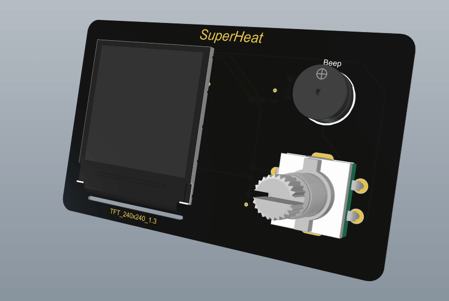
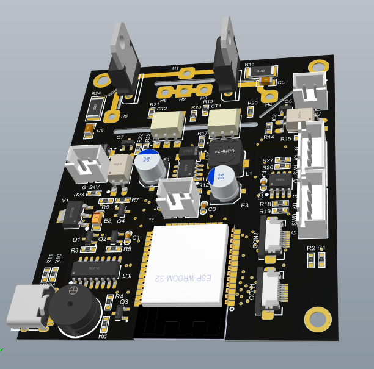

# SuperHeat
多功能加热控制器（二代），平板加热台、风枪双控。

另外：为了充分利用硬件资源，将会附带双路示波器（采样2M）、函数发生器、高精度脉冲输出（可用与点焊机）。额外会有锁屏时钟等等超多功能。

* 本项目的地址 https://github.com/ClimbSnail/SuperHeat （github为最新资料）
* 或者 https://gitee.com/ClimbSnailQ/SuperHeat （gitee非最新，仅为预览）
* 上一代旧版控制器项目 https://github.com/ClimbSnail/HeatPlatform_SMT （底成本方案）

# 项目简介
本项目使用ESP32模组开发。同时控制加热板和风枪工作，亦可 __同时插接两个风枪__ 或 __同时插接两个加热板__ 。

1. 使用TFT 1.3寸240*240的屏幕，使用`LVGL`做界面，增强操作的动画效果。
2. 配套上位机软件，用于`更新固件`和`绘制温控曲线`等等。
3. 分体式设计，使用航空头外接设备，支持单口输出`2000W`功率。
4. 后期将会添加休眠功能，可用于`显示天气`、`监控电脑硬件`等。
5. 还会有更多的功能加入。。。。

# 交流群
添加这个qq群`148563337`，需要的朋友多的话，可以考虑一起做。

##### 前面板

##### 功率控制板

### 铝基板
铝基板使用的是希尔伯特曲线，电阻的计算可以使用此链接https://www.a8blog.com/traceres.htm

调试过程中报错定位代码：`xtensa-esp32-elf-addr2line -pfiaC -e 固件名.elf Backtrace地址信息`

### 更多内容之后补充
目前处于开发阶段，持续完善。