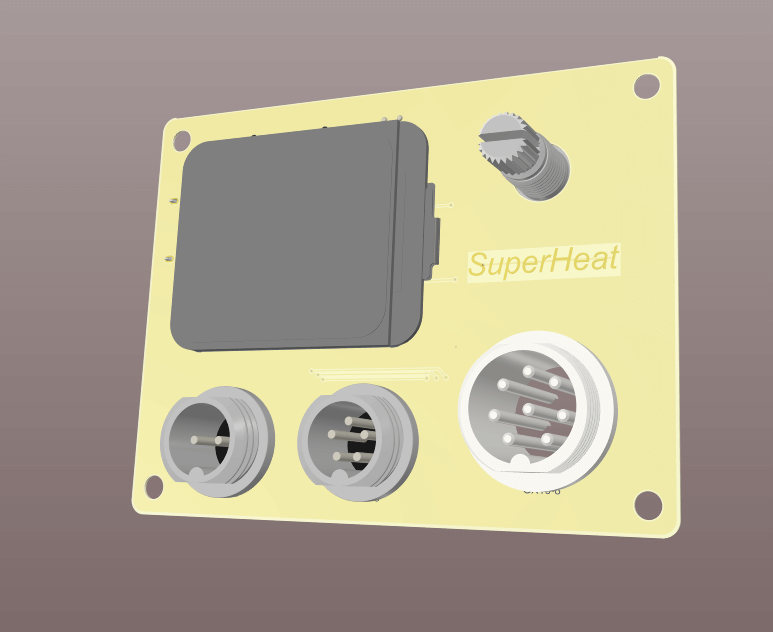
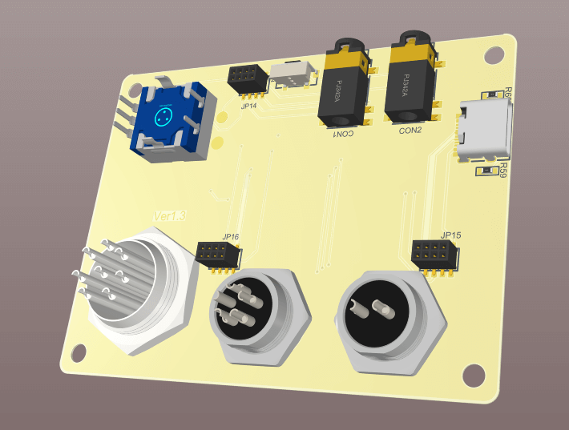
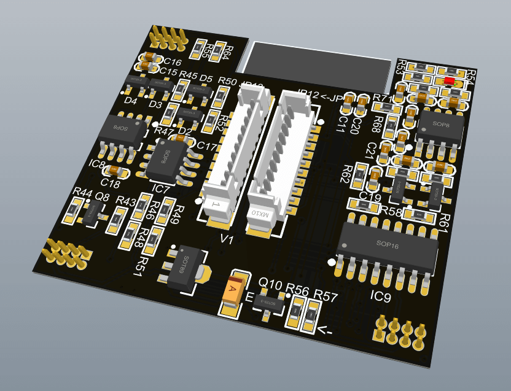

# SnailHeater
多功能焊台，简称 __"蜗牛台"__ 。平板加热台、风枪、T12/C245烙铁、可调电源多控。本项目内有220V高压，务必小心，后果自负。

另外：为了充分利用硬件资源，将会附带双路示波器（采样2M）、函数发生器、高精度脉冲输出（可用与点焊机）。额外会有锁屏时钟等等超多功能。

* 本项目的地址 https://github.com/ClimbSnail/SnailHeater （github为最新资料）
* 或者 https://gitee.com/ClimbSnailQ/SnailHeater （gitee非最新，仅为预览）
* 上一代旧版控制器项目 https://github.com/ClimbSnail/HeatPlatform_SMT （底成本方案）

# 项目简介
__项目开源的目的，做一款适合创客的开源焊台，让老外也能用上中国人开源的焊台！__

本项目使用ESP32S2模组开发。同时控制加热板、风枪、T12/C245烙铁、数字可调电源工作 。本项目将持续优化，不做半吊子。为防止后期咸鱼倒卖，只提供一个简单的demo，主线源码不开源，DIY玩家可免费领取一个序列号。__组装实物图晚点同步更新。__

1. 烙铁支持T12也支持JBC245，内置电源达150W功率，与主控供电隔离。
2. 支持858D相关类型的风枪，同时接口也支持加热板（分体式），最大支持2000W。共两个GX16接口，支持风枪加热板盲插。
3. 可调电源：全数字可调，输出0.8V~23.5V直接的电压，可调电压精度高达0.008V，电流可达5A。内置软件过流保护（可自定义阈值），内置硬件保护（短路保护）。
4. 内置NTC环境补偿。另外还设置全套温度自动校准方案，无需额外测温仪。（注：没有烙铁、风枪温度校准设置的焊台都是耍流氓）
5. 使用TFT 1.69寸240*280的tft彩屏，使用LVGL做界面，增强操作的动画效果。
6. 配套上位机软件，用于更新固件和绘制温控曲线等等。
7. 附带双路DAC采样电路，用于开发双路示波器（最高采样2M）。
8. 预留DAC输出电路，用作单路函数发生器使用。
9. 预留高精度PWM输出接口，可外接点焊机作为可调脉冲信号。（后期提供电焊机配件）
10. 后期将会添加休眠功能，可用于显示天气、监控
8. 还会有更多的功能加入。。。。

# 交流群
添加这个qq群`148563337`，需要的朋友多的话，可以考虑一起做。

# PCB展示
##### 当前测试图

##### 前面板

##### 主控制板

##### 功率板

### 铝基板
发热板，为了极致的性能与便捷，设计并定制了专用的铝发热板，细节到材料。已就绪，工程模型晚些同步。

### 推荐线序
风枪与加热台的线序（其中常规加热台没有风扇）

航空头 GX16-8 | 1 | 2 | 3 | 4 | 5 | 6 | 7 | 8
:-: | :-: | :-: | :-: | :-: | :-: | :-: | :-: | :-:
风枪接线板标识 | + | - | C | GND | + | - | M | M
风枪内部 | 电偶正 | 电偶负、磁控 | 磁控 | 风枪金属外壳 | 风扇正 | 风扇负 | 发热丝 | 发热丝
线序 | 红 | 黑 | 绿 | 黄 | 蓝 | 棕 | 灰 | 白

T12接线改进版（兼容JBC245）

航空头 GX12-5 | 1 | 2 | 3 | 4 | 5
:-: | :-: | :-: | :-: | :-: | :-:
T12 | 地 | P+ | 振动开关正极 | 振动开关/发热芯/热电偶 负极 | 热电偶正极
JBC245 | 可接GND（或空脚） | 发热芯正极 | 振动开关正极 | 振动开关/发热芯/热电偶 负极（GND） | 热电偶正极
线序 | 线色 | 绿 | 红 | 白 | 蓝 | 黑

### 更多内容之后补充
目前处于开发阶段，持续完善。

调试过程中报错定位代码：`xtensa-esp32-elf-addr2line -pfiaC -e 固件名.elf Backtrace地址信息`

platformIO模拟器 https://github.com/lvgl/lv_platformio

### 致谢
* T12电路设计参考 https://github.com/wagiminator/ATmega-Soldering-Station
* PWM实现DAC电路设计 https://www.elecfans.com/d/590628.html
* PWM转DAC如何实现 https://blog.csdn.net/shileiwu0505/article/details/124053815
* 运放的电流检测 https://blog.csdn.net/qq997758497/article/details/79374599