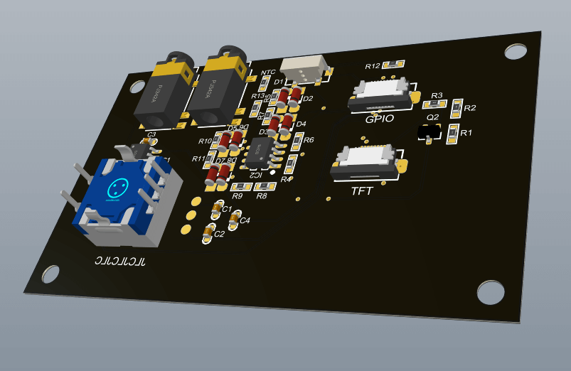
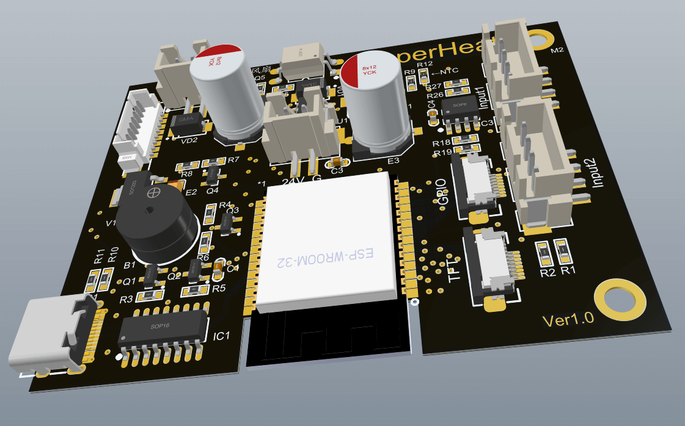
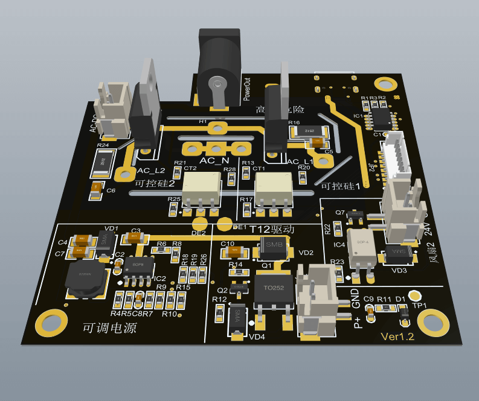

# SuperHeat
多功能加热控制器（二代），平板加热台、风枪、T12烙铁（PD）、可调电源多控。本项目内有220V高压，务必小心，后果自负。

另外：为了充分利用硬件资源，将会附带双路示波器（采样2M）、函数发生器、高精度脉冲输出（可用与点焊机）。额外会有锁屏时钟等等超多功能。

* 本项目的地址 https://github.com/ClimbSnail/SuperHeat （github为最新资料）
* 或者 https://gitee.com/ClimbSnailQ/SuperHeat （gitee非最新，仅为预览）
* 上一代旧版控制器项目 https://github.com/ClimbSnail/HeatPlatform_SMT （底成本方案）

# 项目简介
本项目使用ESP32模组开发。同时控制加热板、风枪、T12烙铁、数字可调电源工作 。

1. 使用TFT 1.69寸240*280的tft彩屏，使用LVGL做界面，增强操作的动画效果。
2. 配套上位机软件，用于更新固件和绘制温控曲线等等。
3. 分体式设计，使用航空头外接设备，支持单口输出2000W功率。
4. 附带双路DAC采样电路，用于开发双路示波器（最高采样2M）。
5. 预留DAC输出电路，用作单路函数发生器使用。
6. 预留高精度PWM输出接口，可外接点焊机作为可调脉冲信号。
7. 后期将会添加休眠功能，可用于显示天气、监控
8. 还会有更多的功能加入。。。。

# 交流群
添加这个qq群`148563337`，需要的朋友多的话，可以考虑一起做。

##### 前面板

##### 主控制板

##### 功率板

### 铝基板
铝基板使用的是希尔伯特曲线，电阻的计算可以使用此链接https://www.a8blog.com/traceres.htm

### 推荐线序
风枪与加热台的线序（其中常规加热台没有风扇）

航空头 GX16-8 | 1 | 2 | 3 | 4 | 5 | 6 | 7 | 8
:-: | :-: | :-: | :-: | :-: | :-: | :-: | :-: | :-:
风枪接线板标识 | + | - | C | GND | + | - | M | M
风枪内部 | 电偶正 | 电偶负、磁控 | 磁控 | 风枪金属外壳 | 风扇正 | 风扇负 | 发热丝 | 发热丝
线序 | 红 | 黑 | 绿 | 黄 | 蓝 | 棕 | 灰 | 白

T12接线

航空头 GX12-5 | 1 | 2 | 3 | 4 | 5
:-: | :-: | :-: | :-: | :-: | :-:
T12 | 地 | P+ | 振动2脚 | 振动1脚 | P- 
线色 | 绿 | 红 | 白 | 蓝 | 黑

### 更多内容之后补充
目前处于开发阶段，持续完善。

调试过程中报错定位代码：`xtensa-esp32-elf-addr2line -pfiaC -e 固件名.elf Backtrace地址信息`
