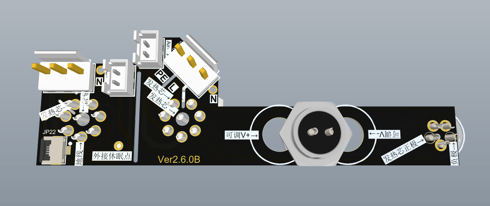
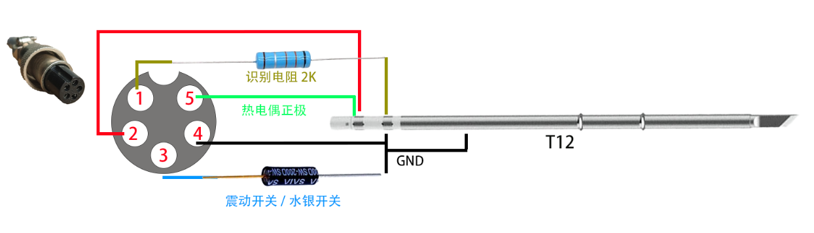
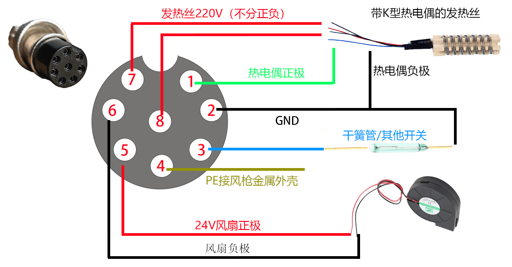

# SnailHeater简介

#### _项目开源的目的，做一款适合创客的开源焊台，让老外也能用上中国人开源的焊台！_

多功能焊台，简称 __"蜗牛台"__ 。平板加热台、风枪、烙铁、可调电源多控。本项目内有220V高压，务必小心，后果自负。

* 本项目的地址 https://github.com/ClimbSnail/SnailHeater （github为最新资料）
* 或者 https://gitee.com/ClimbSnailQ/SnailHeater （gitee非最新，仅为预览）
* 上一代旧版控制器项目 https://github.com/ClimbSnail/HeatPlatform_SMT （底成本方案）

本项目使用ESP32S2模组开发。同时控制加热板、风枪、烙铁、数字可调电源工作 。本项目将持续优化，不做半吊子。为防止后期咸鱼倒卖，只提供一个简单的demo，主线源码不开源，DIY玩家可免费领取2个序列号。

另外：为了充分利用硬件资源，将会附带双路示波器（采样2M）、函数发生器、高精度脉冲输出（可用于点焊机）。额外会有锁屏时钟等等超多功能。

## SnailHeater硬件支持
#### V2.0.X版本硬件
1. 烙铁支持T12、JBC245，内置电源达200W功率，与主控供电隔离。
2. 支持858D相关类型的风枪，同时接口也支持加热板（分体式），最大支持2000W。共两个GX16接口，支持风枪加热板盲插。
3. 可调电源：全数字可调，输出0.8V~22.8V之间的电压，电流可达5A，3A以上负载文波80mv内。内置软件过流保护（可自定义阈值），内置硬件短路保护。（硬件纹波不稳定，待统一通知修复方案）
4. 内置NTC环境补偿。另外还设置全套温度自动校准方案，无需额外测温仪。（注：待固件更新支持）
5. 使用TFT 1.69寸240*280的tft彩屏，使用LVGL做界面，增强操作的动画效果。
6. 配套上位机软件，用于更新固件和绘制温控曲线等等。
7. 附带双路ADC采样电路（内置缓冲），用于开发双路示波器（最高采样2M）。
8. 预留DAC输出电路，用作单路函数发生器使用。
9. 预留高精度PWM输出接口，可外接点焊机作为可调脉冲信号。（后期提供电焊机配件）
10. 后期将会添加休眠功能，可用于显示天气、监控
11. 还会有更多的功能加入。。。。

#### V2.5.X版本硬件
1. 烙铁支持T12、JBC245、JBC210等等，内置双电压电源24V/8A、12V6A，与主控供电隔离。
2. 支持858D相关类型的风枪，同时接口也支持加热板（分体式），最大支持2000W。共两个GX16接口，支持风枪加热板盲插。
3. 可调电源：全数字电压电流可调，输出0.8V~22.8V之间的电压，电流可达0~5A，1A以上负载文波25mv。内置软件过流保护（可自定义阈值），内置硬件短路保护。
4. 内置NTC环境补偿。另外还设置全套温度自动校准方案，无需额外测温仪。（注：待固件更新支持）
5. 使用TFT 1.69寸240*280的tft彩屏，使用LVGL做界面，增强操作的动画效果。
6. 配套上位机软件，用于更新固件和绘制温控曲线等等。
7. 附带双路ADC采样电路（内置缓冲），用于开发双路示波器（最高采样2M）。
8. 预留DAC输出电路，用作单路函数发生器使用。
9. 预留高精度PWM输出接口，可外接点焊机作为可调脉冲信号。（后期提供电焊机配件）
10. 后期将会添加休眠功能，可用于显示天气、监控
11. 还会有更多的功能加入。。。。

# 交流群
加入蜗牛台讨论qq群`148563337`或`686756592`。一起DIY或者跟团。

# PCB展示（V2.5.x版本）
##### 当前测试图

##### 前面板

##### 主控制板

##### 功率板

##### 接线板

##### 刷机工具

# 推荐线序（详细请参考组装教程）

***

### 加热台本体（可参考风枪手柄接线图）

注：SnailHeater加热台与热风枪的物理接口一致，只是少了风扇和开关信号，但整体和热风枪的线序是一致的。热风枪\加热台为AC220供电，故接口将会有高压输出，请勿在通电状态下触摸航空头的`内针`。

SnailHeater的加热台可以使用群内定制的发热板，也可以使用淘宝现成的铸铝发热板，甚至可以使用廉价的PTC发热板。前提是都需要有热电偶测温。

### bin文件路径
* .platformio\packages\framework-arduinoespressif32\variants\adafruit_feather_esp32s2
* .platformio\packages\framework-arduinoespressif32\tools\partitions\boot_app0.bin

### 更多内容之后补充
目前处于开发阶段，持续完善。

调试过程中报错定位代码：`xtensa-esp32s2-elf-addr2line -pfiaC -e 固件名.elf Backtrace地址信息`

platformIO模拟器 https://github.com/lvgl/lv_platformio

应用图标(128*128)：可以下载阿里矢量图 https://www.iconfont.cn/

### 致谢
* T12电路设计参考 https://github.com/wagiminator/ATmega-Soldering-Station
* PWM实现DAC电路设计 https://www.elecfans.com/d/590628.html
* PWM转DAC如何实现 https://blog.csdn.net/shileiwu0505/article/details/124053815
* 运放的电流检测 https://blog.csdn.net/qq997758497/article/details/79374599
* 接地设计 https://blog.csdn.net/sinat_15677011/article/details/126088471